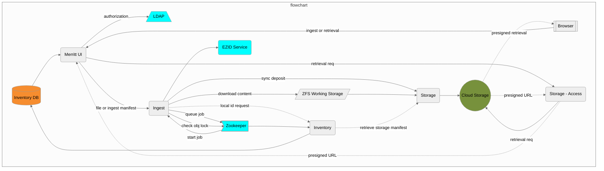
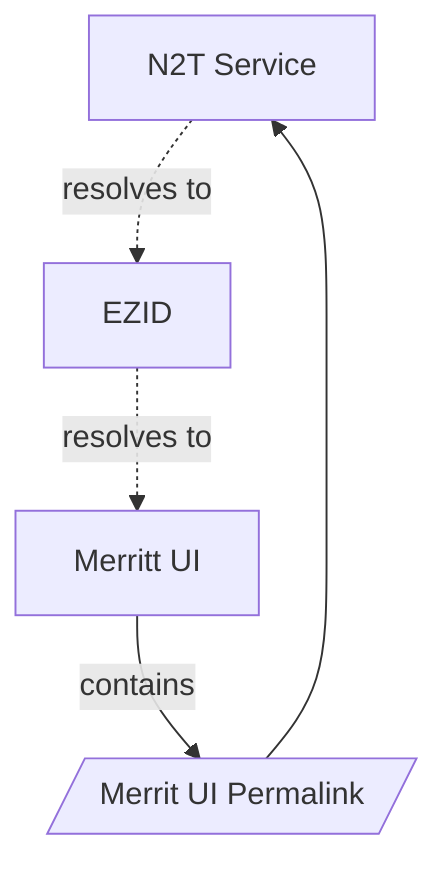
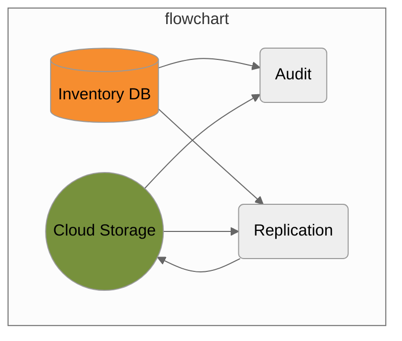

# Merritt 

[Merritt](https://merritt.cdlib.org) is the digital preservation repository for the University of California, available to libraries, academic departments, laboratories and other organizational units within UC. 

## Original System Specifications
- [Merritt Object Model](https://github.com/CDLUC3/mrt-doc/blob/main/doc/Merritt-object-modeling-latest.pdf)
- [Technical Specifications](https://github.com/CDLUC3/mrt-doc/wiki/Technical-Documentation)
- [Digital Object Guidelines](https://github.com/CDLUC3/mrt-doc/blob/main/doc/cdl_gdo_v2021.pdf)

## User Documentation
- For the latest Merritt documentation, see the [wiki](https://github.com/cdluc3/mrt-doc/wiki).
- [Manifest Validation Tool](https://cdluc3.github.io/mrt-doc/manifest/index.html)
- [Manifest Validation Tool with Unit Tests](https://cdluc3.github.io/mrt-doc/manifest/index.html?unittest=1)
- [Merritt Development Resources](https://merritt.uc3dev.cdlib.org/)

## Code Repositories

### Core Microservices 

#### Merritt UI Permalink Resolution

### Audit and Replication Services (Java)

Code Repositories
- Ruby
  - [UI](https://github.com/CDLUC3/mrt-dashboard)
- Java
  - [Ingest](https://github.com/CDLUC3/mrt-ingest)
  - [Inventory](https://github.com/CDLUC3/mrt-inventory)
  - [Storage (Store and Access)](https://github.com/CDLUC3/mrt-store)
  - [Replication](https://github.com/CDLUC3/mrt-replic)
  - [Audit (Fixity Check)](https://github.com/CDLUC3/mrt-audit)

### Libraries
- Java
  - [Core](https://github.com/CDLUC3/mrt-core2)
  - [Cloud](https://github.com/CDLUC3/mrt-cloud)
- Java and Ruby 
  - [Merritt ZK](https://github.com/CDLUC3/mrt-zk) (created in 2024)
- Ruby
  - [SSM Gem](https://github.com/CDLUC3/uc3-ssm) - Shared with other UC3 services
  - [Merritt Atom](https://github.com/cdluc3/mrt-atom) - Nuxeo processing for ingest
    - Uses [Ruby Ingest](https://github.com/CDLUC3/mrt-ingest-ruby)

### Configuration
- [Tomcat](https://github.com/CDLUC3/mrt-tomcat)

### Supporting Services
- [Merritt Testing](testing.md)
- Java 
  - [Merritt Box Tools](https://github.com/CDLUC3/mrt-box) 
- Ruby
  - [Merritt Admin Tool - UC3 Account](https://github.com/CDLUC3/mrt-admin-sinatra) 
  - [Merritt End to End Tests](https://github.com/CDLUC3/mrt-integ-tests)
  - [Merritt Integration Test Images](https://github.com/CDLUC3/merritt-docker/tree/main/mrt-inttest-services)
  - [Ingest Workspace Manifest Builder](https://github.com/CDLUC3/s3-sinatra) 
- Docker
  - [Merritt Docker](https://github.com/CDLUC3/merritt-docker)
- Other
  - [Merritt Maintenance Scripts](https://github.com/CDLUC3/mrt-maint)
- Python
  - [Merritt Repository Tagger](https://github.com/CDLUC3/mrt-repo-tagger)
  - [Merritt Locust Testing](https://github.com/CDLUC3/mrt-locust)

## Merritt DevOps
- [Merritt Build System Design](https://github.com/CDLUC3/mrt-doc/tree/main/design/aws-build)
- [Merritt Tomcat Deploy](https://github.com/CDLUC3/mrt-tomcat-deploy)
- [Merritt Service Release Manifest](https://github.com/CDLUC3/mrt-service-release-manifest)
- [Merritt Sceptre Scripts](https://github.com/CDLUC3/mrt-sceptre)
- Deprecated?
  - [Merritt Ansible Deployment Tools](https://github.com/CDLUC3/mrt-ansible-service-restart)  

## Project Overview
- [Project Board](https://github.com/CDLUC3/mrt-doc/projects/1)
- [System Operations Board](https://github.com/CDLUC3/mrt-doc/projects/4)
- [System Enhancement Ideas Grouped by Theme](https://github.com/CDLUC3/mrt-doc/milestones)

## More info
- [Deprecated Functionality](deprecated_functionality.md)

---

## Internal Links
- [Merritt Troubleshooting](https://github.com/CDLUC3/mrt-doc-private/blob/main/docs/system-recovery/README.md)
