# Merritt 

[Merritt](https://merritt.cdlib.org) is the digital preservation repository for the University of California, available to libraries, academic departments, laboratories and other organizational units within UC.

## User Documentation
For the latest Merritt documentation, see the [wiki](https://github.com/cdluc3/mrt-doc/wiki).

## Code Repositories

### Core Microservices (Java)

- [UI](https://github.com/CDLUC3/mrt-dashboard)
- [Ingest](https://github.com/CDLUC3/mrt-ingest)
- [Inventory](https://github.com/CDLUC3/mrt-inventory)
- [Storage (ingest and delivery)](https://github.com/CDLUC3/mrt-store)

### Audit and Replication Services (Java)

- [Replication](https://github.com/CDLUC3/mrt-replic)
- [Audit (Fixity Check)](https://github.com/CDLUC3/mrt-audit)

### Microservices - Auxiliary (Java)

- [Sword](https://github.com/CDLUC3/mrt-sword)
- [OAI](https://github.com/CDLUC3/mrt-oai)

### Other Production Services (Python/XSLT)
- [ETD - Electronic Theses and Dissertations](https://github.com/CDLUC3/uc3-etds)

### Libraries
- Java
  - [Core](https://github.com/CDLUC3/mrt-core2)
  - [Cloud](https://github.com/CDLUC3/mrt-cloud)
  - [Zoo](https://github.com/CDLUC3/mrt-zoo)
  - [ZK Queue](https://github.com/CDLUC3/cdl-zk-queue)
  - [Cloud Content Tools](https://github.com/CDLUC3/mrt-cloudhost-pub)
- Ruby
  - [Ruby Ingest](https://github.com/CDLUC3/mrt-ingest-ruby)
  - [SSM Gem](https://github.com/CDLUC3/uc3-ssm)

### Configuration
- [Tomcat](https://github.com/CDLUC3/mrt-tomcat)
- [Catalina Base](https://github.com/CDLUC3/tomcat8_catalina_base)

### Supporting Services
- Ruby
  - [Admin Tool](https://github.com/CDLUC3/mrt-admin-lambda)
  - [Integration Tests](https://github.com/CDLUC3/mrt-integ-tests)
  - [Merritt Manifest Tools](https://github.com/CDLUC3/merritt-manifest)
- Docker
  -[Merritt Docker](https://github.com/CDLUC3/merritt-docker)
### Documentation Tools (Python)
-  [Merritt Repository Tagger](https://github.com/CDLUC3/mrt-repo-tagger)

## Project Overview
- [Project Board](https://github.com/CDLUC3/mrt-doc/projects/1)
- [System Operations Board](https://github.com/CDLUC3/mrt-doc/projects/4)
- [System Enhancement Ideas Grouped by Theme](https://github.com/CDLUC3/mrt-doc/milestones)

## More info

