# AWS Build of Merritt Assets
- CloudFront: https://github.com/CDLUC3/mrt-doc/issues/1850
- CodeArtifact: https://github.com/CDLUC3/mrt-doc/issues/1931
- ECR: https://github.com/CDLUC3/mrt-doc/issues/1945
- Private Bucket:
  - https://github.com/CDLUC3/mrt-doc/issues/1923
  - https://github.com/CDLUC3/mrt-doc/issues/1924
 
## Tagging Ideas
- [Tagging Ideas](tagging.md)

## Using CodeArtifact Resources in a Docker Build
- https://stackoverflow.com/questions/67426509/how-to-use-aws-codeartifact-within-a-dockerfile-in-awscodebuild

## Workflow

### Build Integration Test Images

> [!NOTE]
> Some Merritt Java Libraries and Services have integration tests as part of their code.
> These integration tests run against mocked services that are implemented as docker images.
> These Docker Images must be build first.

#### Build Trigger
- Triggered by commit to merritt-docker
- Triggered on demand

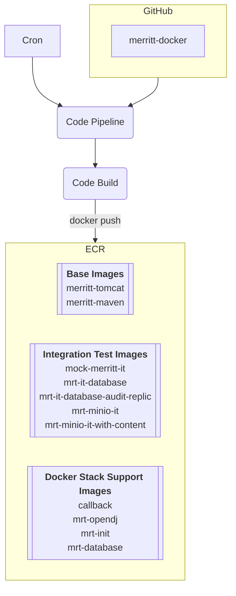

---

### Java Libraries

> [!NOTE]
> Merritt Java libraries are compiled and packaged as Jar files.
> These Jar files are saved to AWS CodeArtifact.
> Merritt libraries will always be written to CodeArtifact as a *maven snapshot* `-SNAPSHOT.jar`.
> Snapshots can be over-written in CodeArtifact.
> Going forward, the Merritt Team will bump up the snapshot version number for a jar file when making a breaking change to the JAR file.
> The updated snapshot number will then need to be registered in the bom file. 

#### Build Trigger
- Triggered by commit to repo
- Triggered on demand

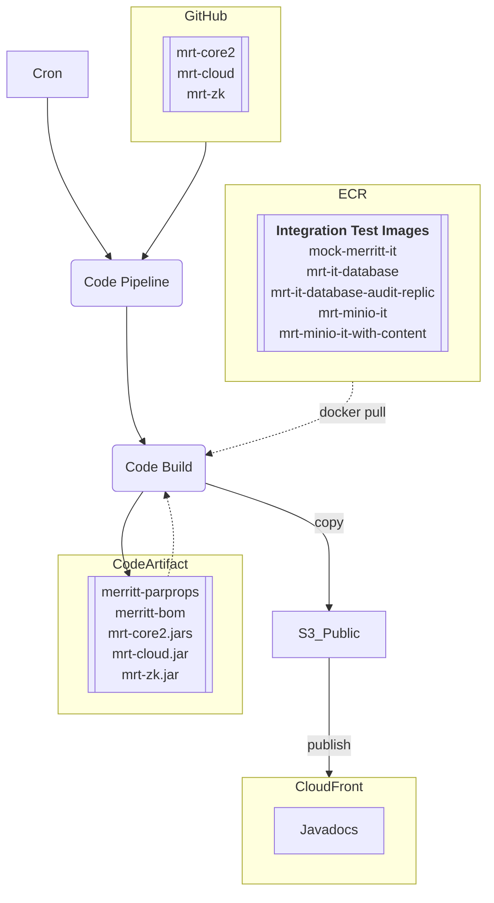

---

### Java Services (WAR)

> [!NOTE]
> Merritt Java services are compiled and packaged as War files.
> These Jar files are saved to AWS CodeArtifact.
> Development artifacts may be written to CodeArtifact as a *maven snapshot* `-SNAPSHOT.war`.
> Snapshots can be over-written in CodeArtifact.
> Release candidates for an artifact must be generated with a unique semantic tag.
> Artifacts with a semantic tag (non-snapshots) may not be over-written.
> The Merritt code deployment process will pull WAR files from CodeArtifact. 

#### Build Trigger
- Triggered by commit to repo (snapshot update)
- Triggered on demand (snapshot update)
- Triggered by the tagging of a repo (semantically tagged artifact)

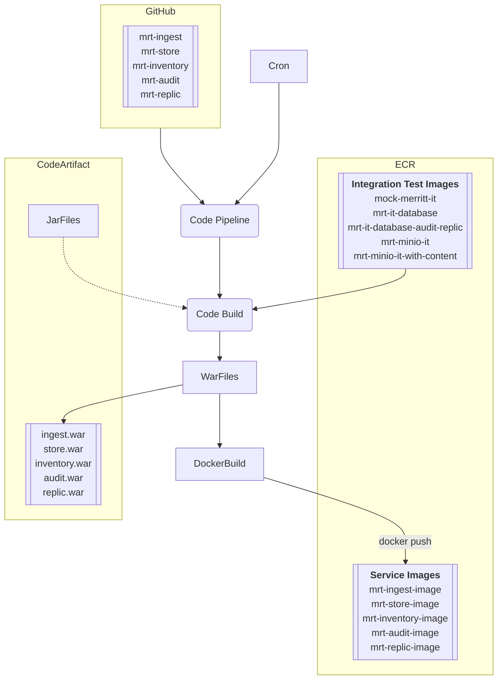

---

### Java Service Deployment
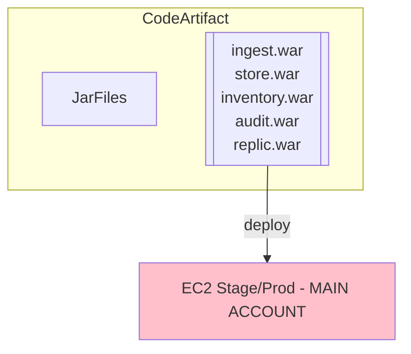

---

### Ruby Library Build
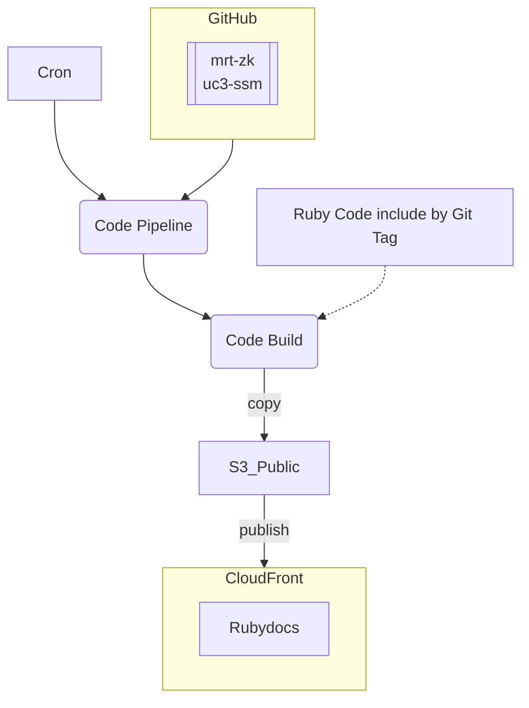

### Ruby Service Deploy
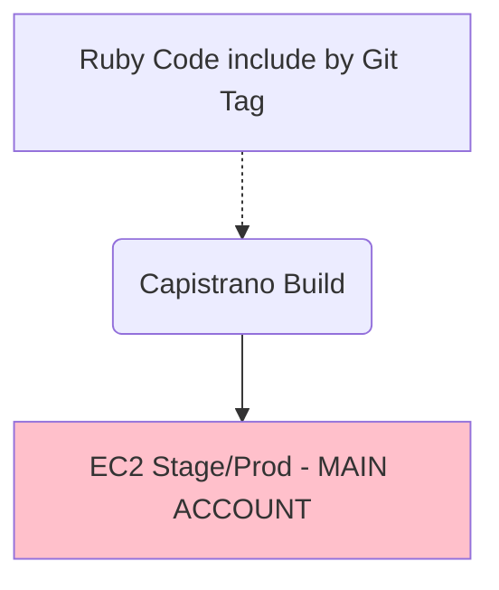

---

### Ruby Service Build Image
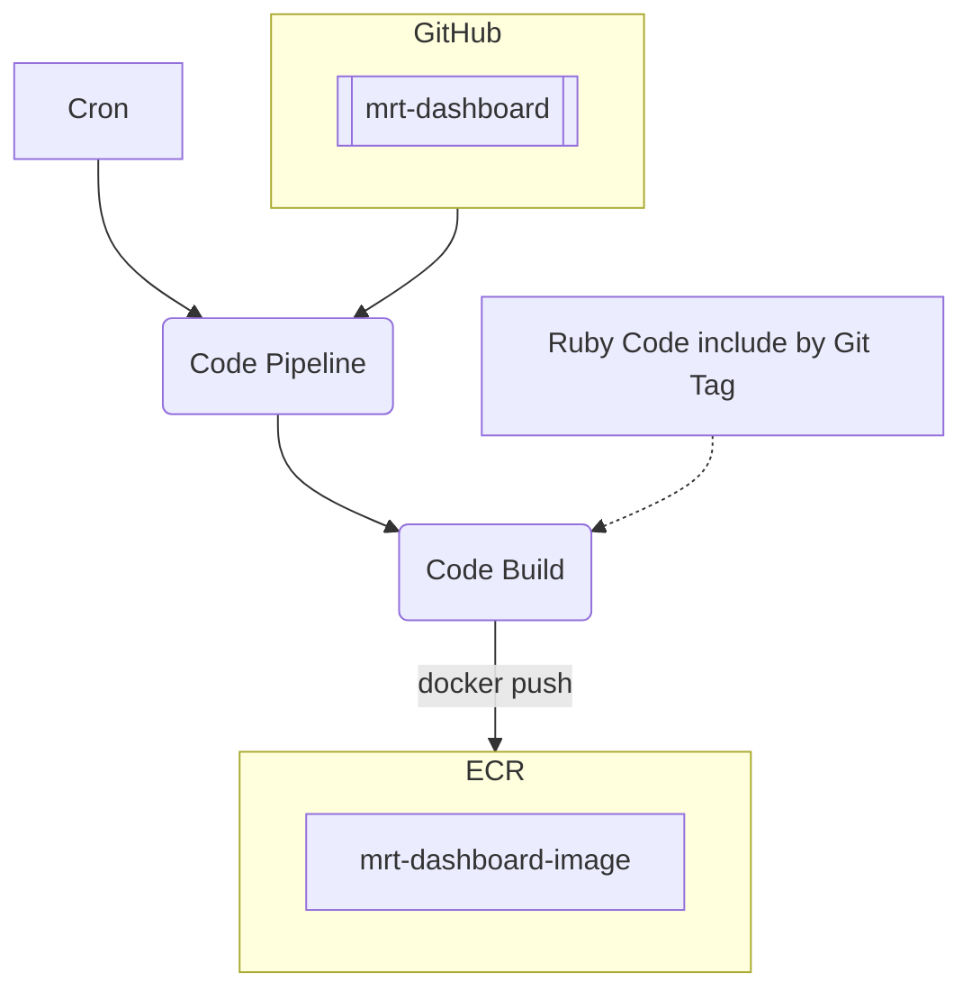

---

### Run Docker Stack
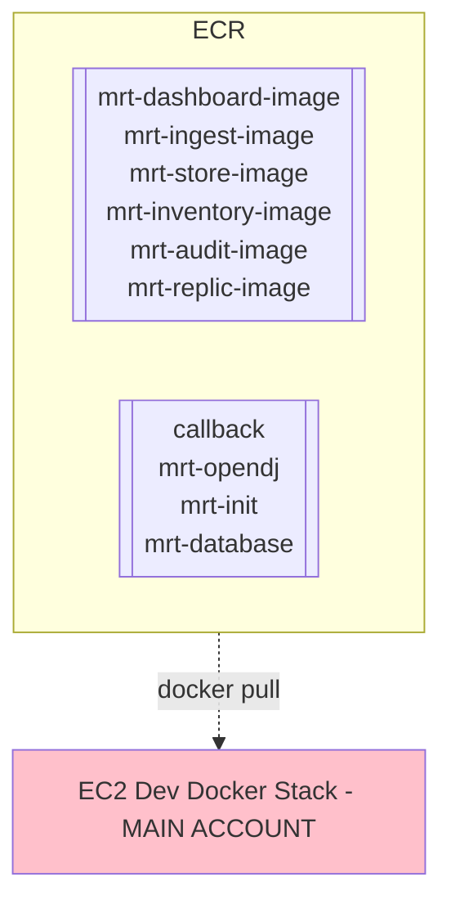

---

### Ruby Lambda Build and Deploy
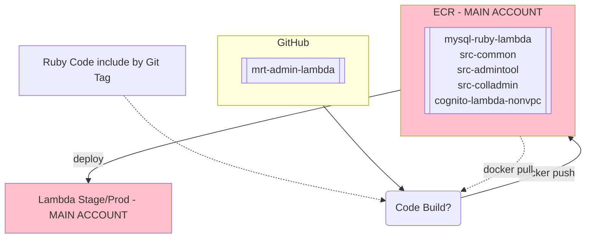

---

### Documentation and Web Assets
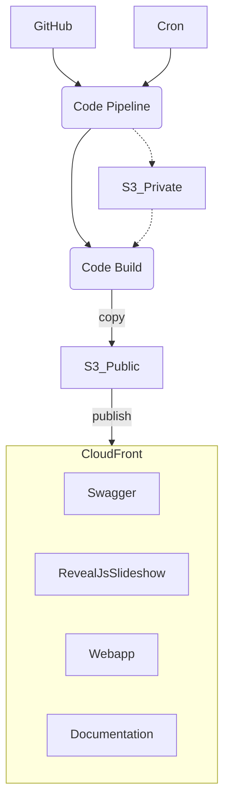

---

### Private Config Data - Evolve From File System Copy
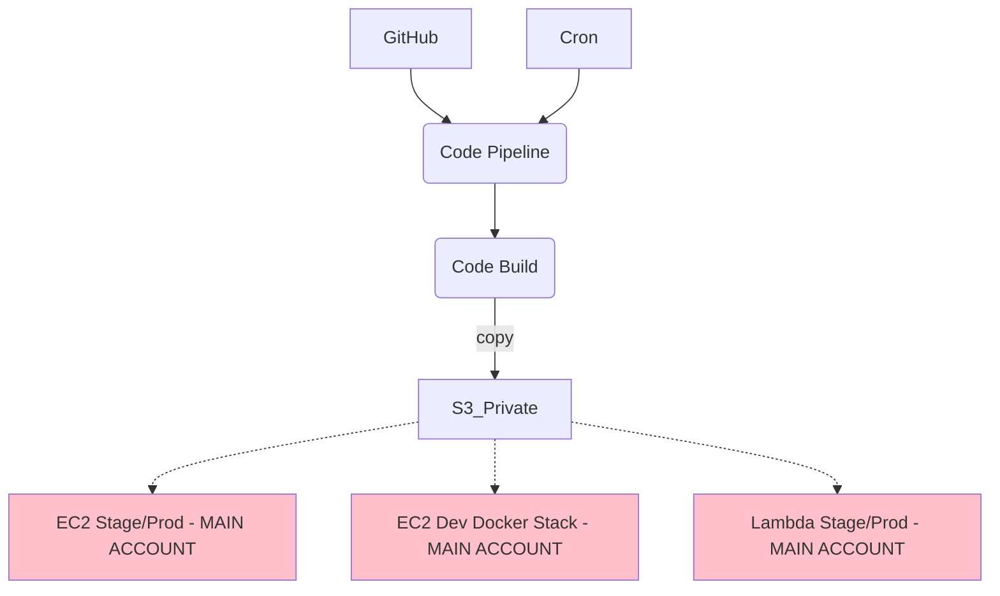

## Anticipated Outputs
- https://merritt.uc3dev.cdlib.org/index.html
  - [html source](https://github.com/CDLUC3/merritt-tinker/blob/main/aws/uc3-mrt-devresources/index.html)

