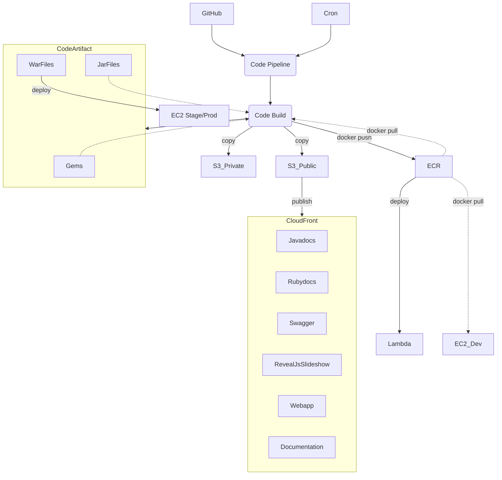
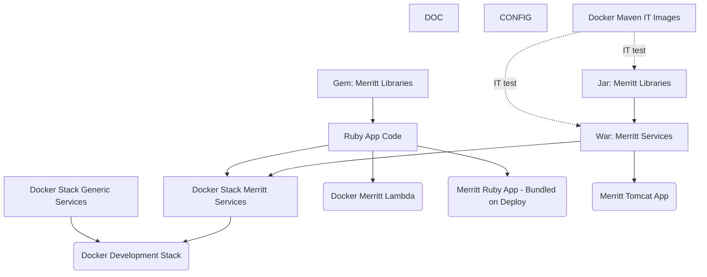

# AWS Build of Merritt Assets
- CloudFront: https://github.com/CDLUC3/mrt-doc/issues/1850
- CodeArtifact: https://github.com/CDLUC3/mrt-doc/issues/1931
- ECR: https://github.com/CDLUC3/mrt-doc/issues/1945
- Private Bucket:
  - https://github.com/CDLUC3/mrt-doc/issues/1923
  - https://github.com/CDLUC3/mrt-doc/issues/1924

## Workflow

---

## Artifact Build Order

### Anticipated Outputs
- https://merritt.uc3dev.cdlib.org/index.html
  - [html source](https://github.com/CDLUC3/merritt-tinker/blob/main/aws/uc3-mrt-devresources/index.html)

