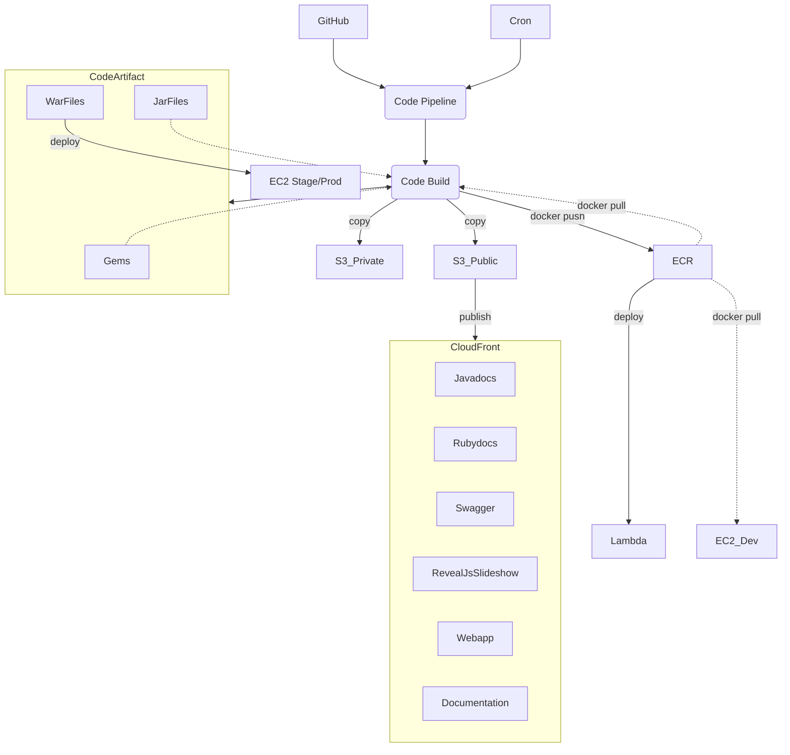
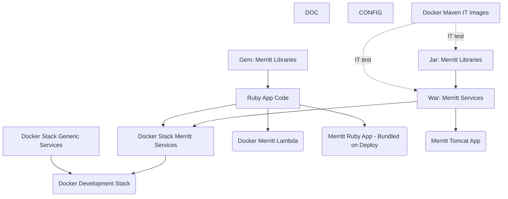

# AWS Build of Merritt Assets
- CloudFront: https://github.com/CDLUC3/mrt-doc/issues/1850
- CodeArtifact: https://github.com/CDLUC3/mrt-doc/issues/1931
- ECR: https://github.com/CDLUC3/mrt-doc/issues/1945
- Private Bucket:
  - https://github.com/CDLUC3/mrt-doc/issues/1923
  - https://github.com/CDLUC3/mrt-doc/issues/1924

## Workflow

---

## Artifact Build Order

### Repos

- Documentation
  - mrt-doc
    - Outputs: Cloudfront Webapp (Manifest Tool)
  - mrt-doc-private
  - merritt_ldap_tools
  - mrt-ansible-service-restart
  - mrt-box
  - mrt-maint
  - mrt-jenkins
- Configuration
  - mrt-ingest-profiles
    - Private S3 bucket
  - mrt-dashboard-config
    - Private S3 bucket
  - mrt-tomcat
- Docker Maven IT Images
  - merritt-docker_inttest
    - Outputs: ECR Image
- Docker Stack Generic Services
  - zookeeper
  - mysql
  - minio
  - ldap
  - smtp_mock
  - ezid_mock
  - merritt_init
  - callback
  - mrt-integ-tests
- Docker Stack Merritt Services
  - store
  - ingest
  - audit
  - replic
  - inventory
  - ui
- Jar: Merritt Libraries
  - Outputs: Code Artifact and Javadoc
  - mrt-zk_java
  - mrt-core2
  - mrt-cloud
- War: Merritt Services
  - Outputs: Code Artifact and ECR Image
  - mrt-store
  - mrt-ingest
  - mrt-audit
  - mrt-replic
  - mrt-inventory
- Gem: Merritt Libraries
  - Outputs: Code Artifact and Rubydocs
  - uc3-ssm
  - mrt-zk_ruby
- Ruby App Code
  - mrt-dashboard
    - Outputs: ECR Image, Cloudfront: Swagger Docs
  - mrt-admin-lambda
    - Outputs: ECR Image, Cloudfront: Generated Documentation
  - mrt-cron
    - Outputs: Cloudfront: RevealJS presentation
  - mrt-atom
- Deprecated Libraries
  - cdl-zk-queue
  - mrt-zoo

