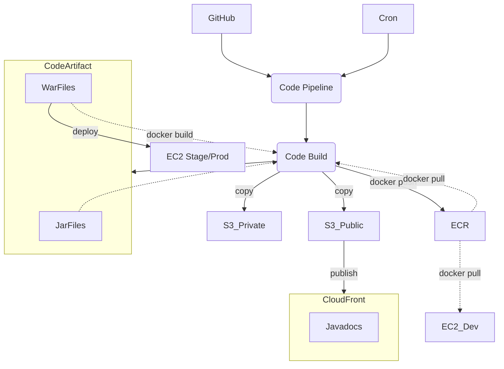
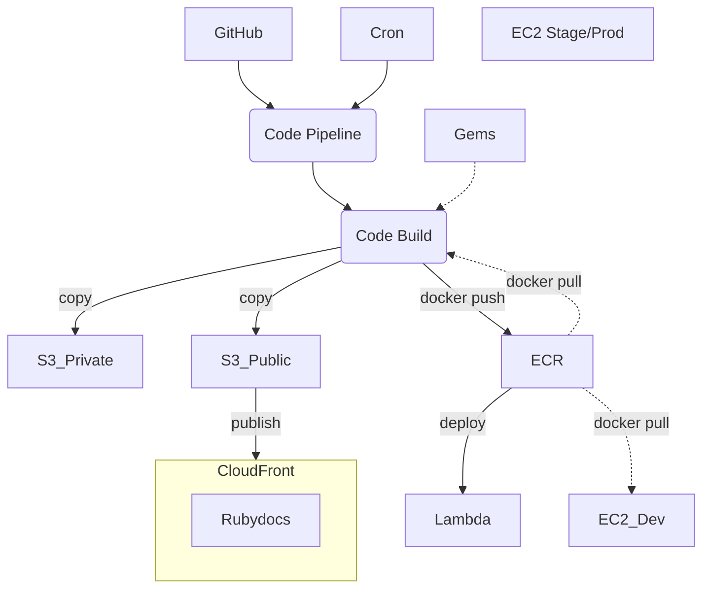
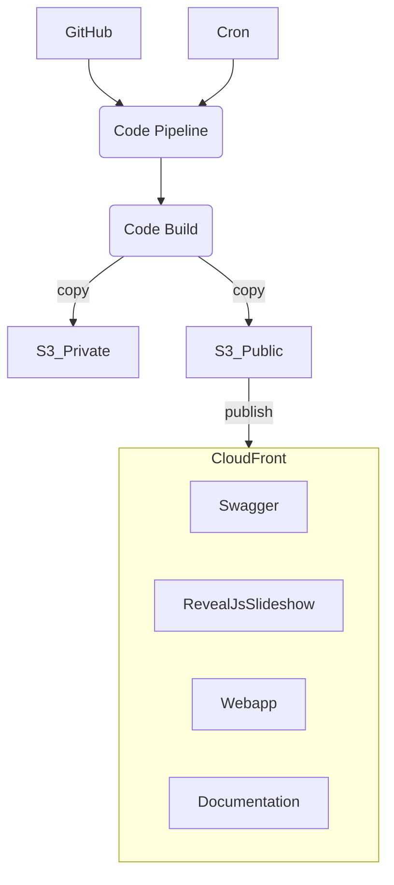
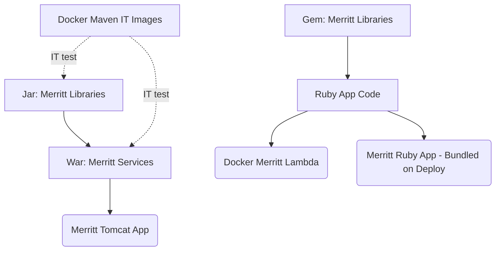
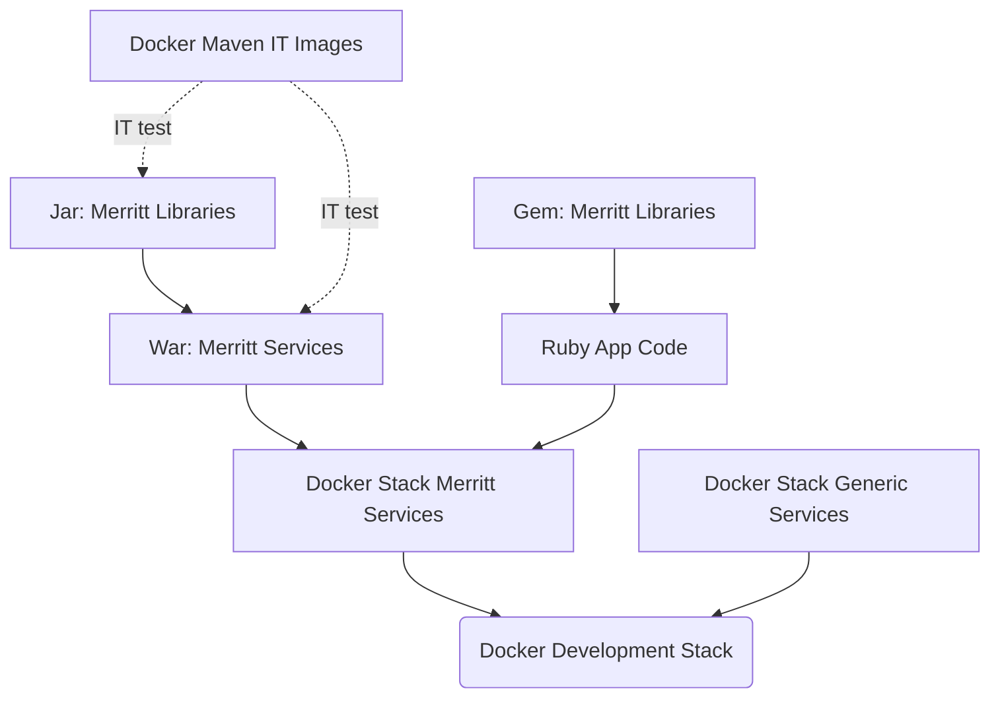

# AWS Build of Merritt Assets
- CloudFront: https://github.com/CDLUC3/mrt-doc/issues/1850
- CodeArtifact: https://github.com/CDLUC3/mrt-doc/issues/1931
- ECR: https://github.com/CDLUC3/mrt-doc/issues/1945
- Private Bucket:
  - https://github.com/CDLUC3/mrt-doc/issues/1923
  - https://github.com/CDLUC3/mrt-doc/issues/1924

## Workflow

### Java Code

### Ruby Code

### Documentation and Web Assets

---

## Artifact Build Dependencies

### Stage/Production Deployments

### Development Testing

### Build Sequence
1. Build Docker Maven IT Images --> ECR
2. Build Docker Stack Generic Services --> ECR
3. Build JAR files --> Code Artifact
4. Ruby libraries and gems - build from github tag rather than from a gem
5. Build WAR files --> Code Artifact
6. Build Docker Stack Merritt Services (Tomcat and Rails) --> ECR
7. Build Lambda Docker Images --> ECR

## Anticipated Outputs
- https://merritt.uc3dev.cdlib.org/index.html
  - [html source](https://github.com/CDLUC3/merritt-tinker/blob/main/aws/uc3-mrt-devresources/index.html)

## Environment Variables for Builds

### SSM Inputs
- /uc3/mrt/codestar
  - TODO: could Sceptre introspect this with a query? 

### Stack Output
- domain: 'merritt.uc3dev.cdlib.org'
- hosted_zone: ... # note that DMP stores this in SSM
- S3CFBUCKET
- S3PRIVBUCKET
- CFDISTRIBUTIONID ... # used to invalidate a cloudfront cache

### Computed Environment or Hard Coded
- export AWS_ACCOUNT_ID=`aws sts get-caller-identity| jq -r .Account`
- export AWS_REGION=us-west-2
- export ECR_REGISTRY=${AWS_ACCOUNT_ID}.dkr.ecr.${AWS_REGION}.amazonaws.com
- export CODEARTIFACT_AUTH_TOKEN=`aws codeartifact get-authorization-token --domain cdlib-uc3-mrt --domain-owner $AWS_ACCOUNT_ID --region us-west-2 --query authorizationToken --output text`

