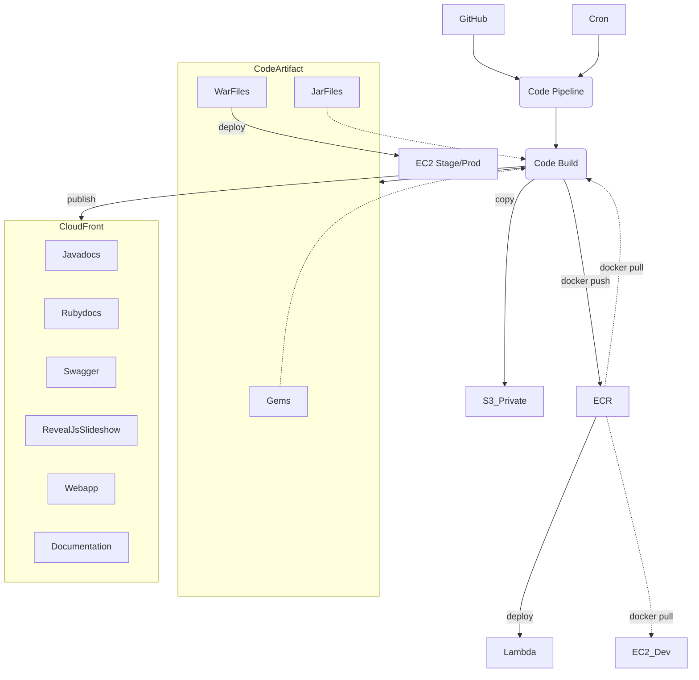
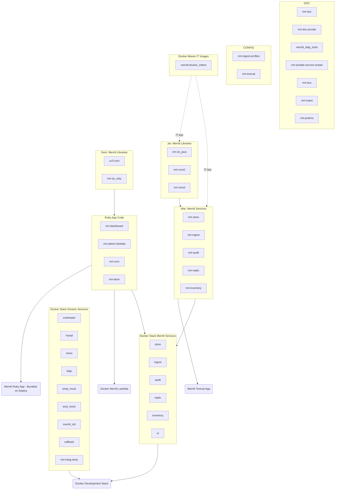
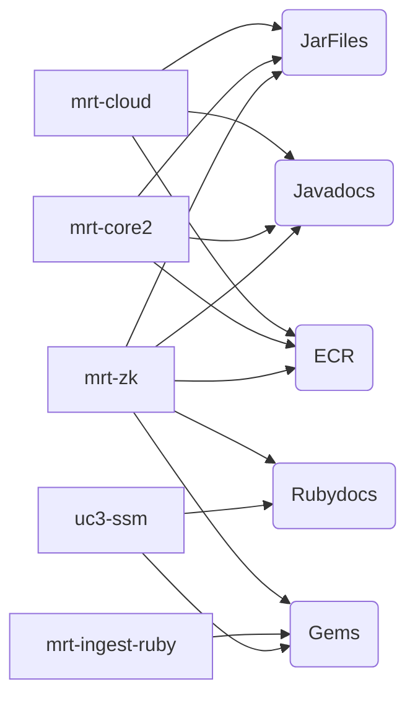
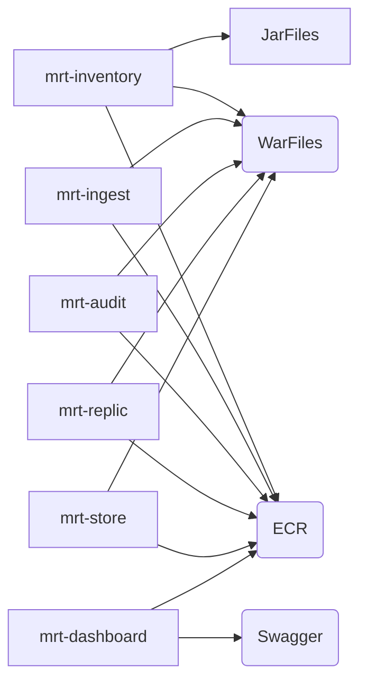
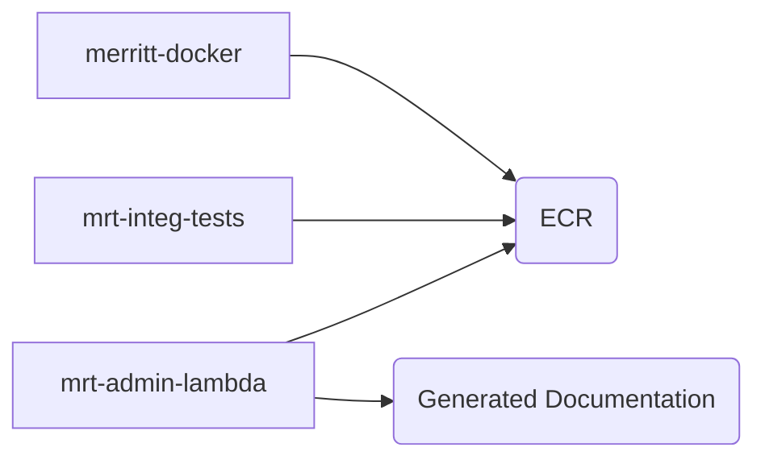
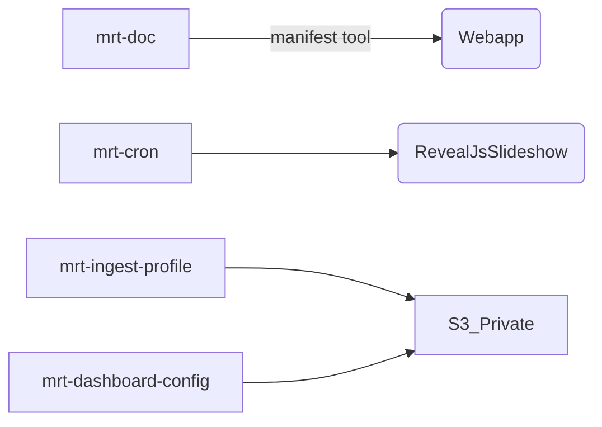
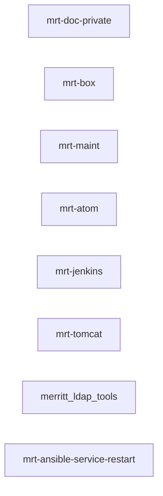
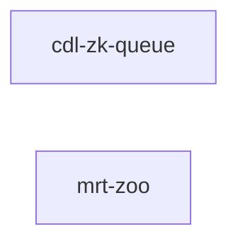

# AWS Build of Merritt Assets
- CloudFront: https://github.com/CDLUC3/mrt-doc/issues/1850
- CodeArtifact: https://github.com/CDLUC3/mrt-doc/issues/1931
- ECR: https://github.com/CDLUC3/mrt-doc/issues/1945
- Private Bucket:
  - https://github.com/CDLUC3/mrt-doc/issues/1923
  - https://github.com/CDLUC3/mrt-doc/issues/1924

## Workflow

---

## Artifact Build Order

---

## Library Repo Outputs

## Service Repo Outputs

## Docker Repo Outputs

## Misc Repo Outputs

## No Repo Outputs

## Deprecated Repo Outputs

