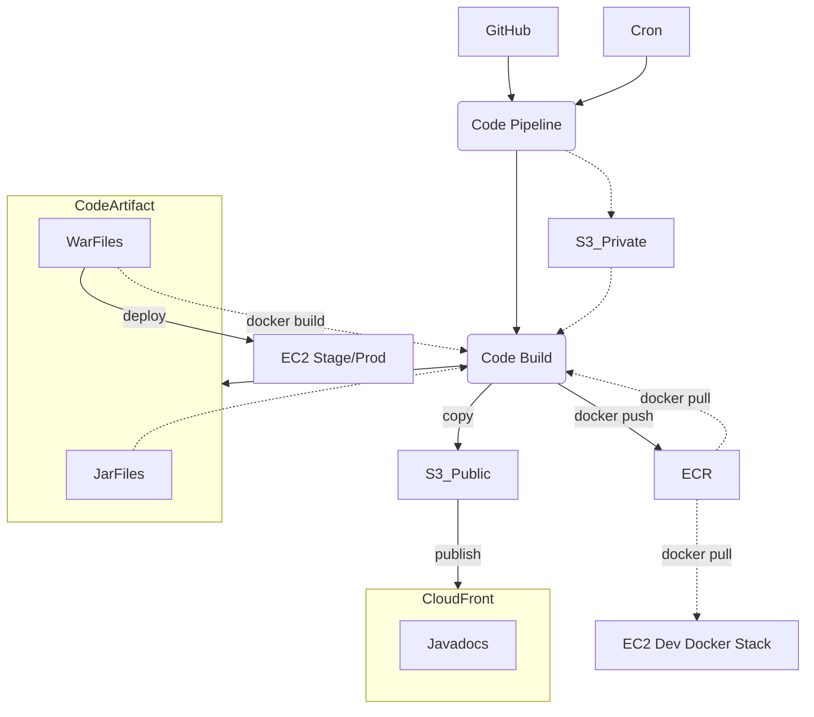
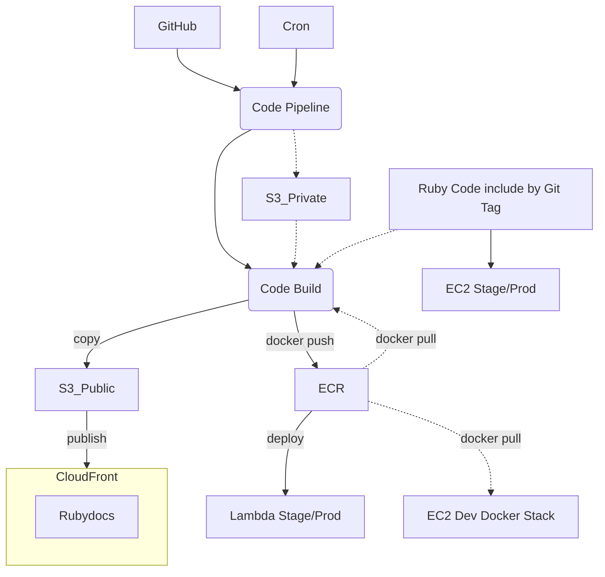
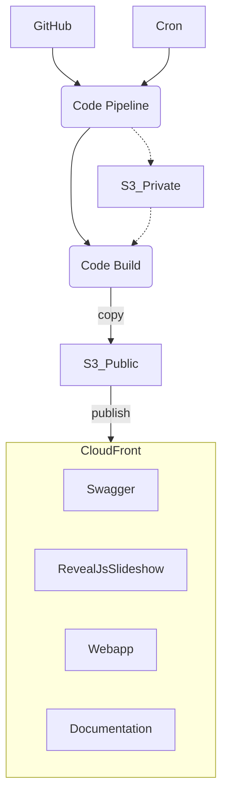
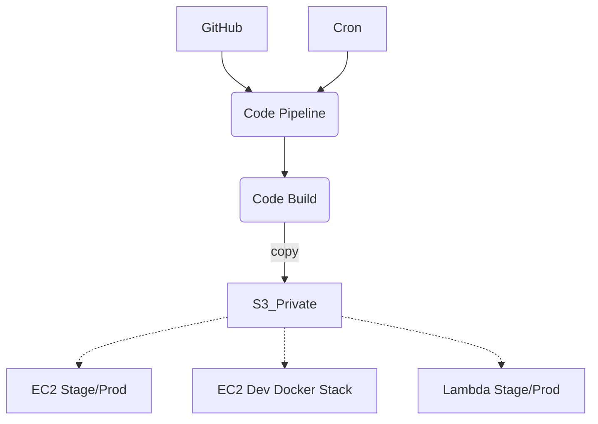
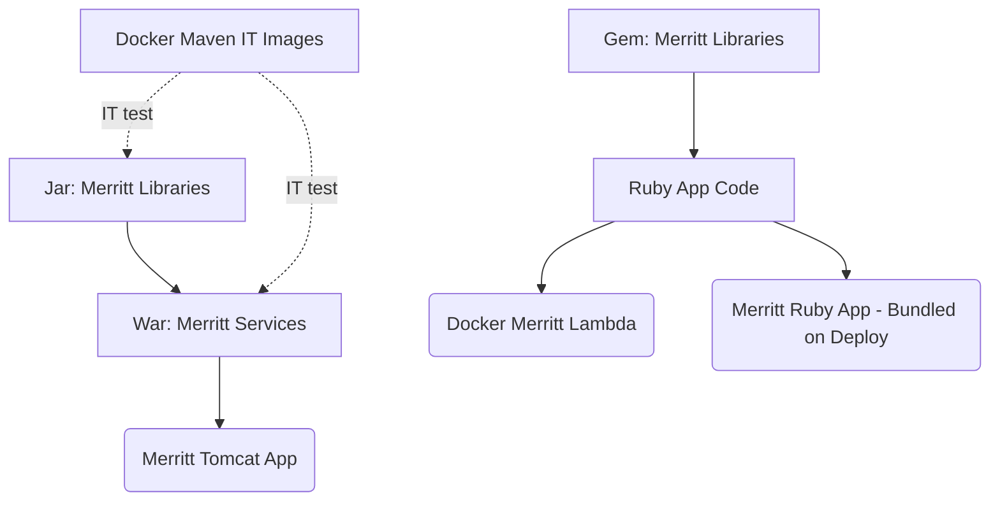
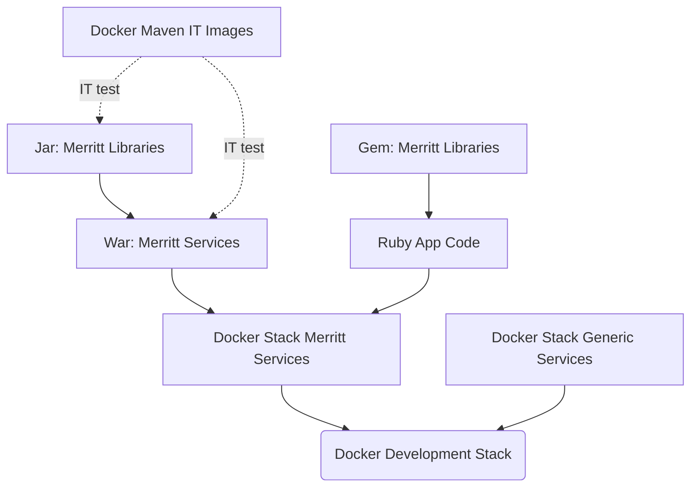

# AWS Build of Merritt Assets
- CloudFront: https://github.com/CDLUC3/mrt-doc/issues/1850
- CodeArtifact: https://github.com/CDLUC3/mrt-doc/issues/1931
- ECR: https://github.com/CDLUC3/mrt-doc/issues/1945
- Private Bucket:
  - https://github.com/CDLUC3/mrt-doc/issues/1923
  - https://github.com/CDLUC3/mrt-doc/issues/1924
 
## Tagging Ideas
- [Tagging Ideas](tagging.md)

## Using CodeArtifact Resources in a Docker Build
- https://stackoverflow.com/questions/67426509/how-to-use-aws-codeartifact-within-a-dockerfile-in-awscodebuild

## Workflow

### Java Code


### Ruby Code


### Documentation and Web Assets


### Private Config Data - Evolve From File System Copy


---

## Artifact Build Dependencies

### Stage/Production Deployments


### Development Testing



### Build Sequence
1. Build Docker Maven IT Images --> ECR
2. Build Docker Stack Generic Services --> ECR
3. Build JAR files --> Code Artifact
4. Ruby libraries and gems - build from github tag rather than from a gem
5. Build WAR files --> Code Artifact
6. Build Docker Stack Merritt Services (Tomcat and Rails) --> ECR
7. Build Lambda Docker Images --> ECR


## Anticipated Outputs
- https://merritt.uc3dev.cdlib.org/index.html
  - [html source](https://github.com/CDLUC3/merritt-tinker/blob/main/aws/uc3-mrt-devresources/index.html)

## Permission Needs

### Maven settings.xml file

The following settings.xml file allows a maven task to utilize assets from a CodeArtifact repo.  

This file is stored in `~/.m2/settings.xml` by defualt.

```
<settings xmlns="http://maven.apache.org/SETTINGS/1.0.0" xmlns:xsi="http://www.w3.org/2001/XMLSchema-instance"
  xsi:schemaLocation="http://maven.apache.org/SETTINGS/1.0.0 https://maven.apache.org/xsd/settings-1.0.0.xsd">
  <localRepository/>
  <interactiveMode/>
  <offline/>
  <pluginGroups/>
  <servers>
    <server>
      <id>cdlib-uc3-mrt-uc3-mrt-java</id>
      <username>aws</username>
      <password>${env.CODEARTIFACT_AUTH_TOKEN}</password>
    </server>
  </servers>
  <mirrors/>
  <proxies/>
  <profiles>
    <profile>
      <id>cdlib-uc3-mrt-uc3-mrt-java</id>
      <activation>
        <activeByDefault>true</activeByDefault>
      </activation>
      <repositories>
        <repository>
          <id>cdlib-uc3-mrt-uc3-mrt-java</id>
          <url>https://cdlib-uc3-mrt-${env.AWS_ACCOUNT_ID}.d.codeartifact.us-west-2.amazonaws.com/maven/uc3-mrt-java/</url>
        </repository>
      </repositories>
    </profile>
  </profiles>
  <activeProfiles/>
</settings>
```

### Set Up: CodeBuild Job
The following Environment variables will be set.
```
        EnvironmentVariables:
          - Name: 'S3CFBUCKET'
            Value: !Ref S3CFBucketId
          - Name: 'S3PRIVBUCKET'
            Value: !Ref S3MrtPrvId
          - Name: 'CFDISTRIBUTIONID'
            Value: !Ref CloudfrontDistroId
          - Name: 'AWS_ACCOUNT_ID'
            Value: !Sub '${AWS::AccountId}'
          - Name: 'AWS_REGION'
            Value: !Sub '${AWS::Region}'
          - Name: 'ECR_REGISTRY'
            Value: !Sub '${AWS::AccountId}.dkr.ecr.${AWS::Region}.amazonaws.com'
          - Name: 'CODEARTIFACT_URL'
            Value: !Sub 'https://cdlib-uc3-mrt-${AWS::AccountId}.d.codeartifact.${AWS::Region}.amazonaws.com/maven/uc3-mrt-java/'
```

Each buildspec.yml file will contain the following
```
      - cp settings.xml ~/.m2/
      - export CODEARTIFACT_AUTH_TOKEN=`aws codeartifact get-authorization-token --domain cdlib-uc3-mrt --domain-owner $AWS_ACCOUNT_ID --region us-west-2 --query authorizationToken --output text`
      - aws ecr get-login-password --region $AWS_REGION | docker login --username AWS --password-stdin ${ECR_REGISTRY}
```

### Set Up: Main Account Jobs

- Create a ~/.m2/settings.xml file with the UC3 DEV account number hard-coded
- Set CODEARTIFACT_AUTH_TOKEN using the UC3 DEV account number (see above)
- Set ECR_REGISTRY using the UC3 DEV account number (see above)
- Run `aws ecr get-login-password ...`

## Code Artifact

### Push to CodeArtifact

The following is added to pom.xml files.

```
<distributionManagement>
      <repository>
        <id>cdlib-uc3-mrt-uc3-mrt-java</id>
        <name>cdlib-uc3-mrt-uc3-mrt-java</name>
       <url>https://cdlib-uc3-mrt-${env.AWS_ACCOUNT_ID}.d.codeartifact.us-west-2.amazonaws.com/maven/uc3-mrt-java/</url>
      </repository>
    </distributionManagement>
```

#### CodeBuild Job
- `mvn deploy` will be supported

#### Main Account Sessions
- `mvn deploy` will NOT be supported

### Read from CodeArtifact

#### CodeBuild Job
- mvn tasks should use CodeArtifact resources

#### Main Account Sessions
- mvn tasks should use CodeArtifact resources
- delete ~/.m2/settings.xml to ignore CodeArtifact

## ECR
- Merritt images should live exclusively in EITHER Main Account ECR or UC3 DEV ECR.
- Individual Images should not reside in both.
- Production and Stage Lambda code should initially remain in the Main Account ECR.  Migration can be considered later.

### Push to ECR (UC3 Account)

#### Build Jobs
- Enabled

#### Main Account Session
- Perhaps we should only PULL

### Pull from ECR (UC3 Account)

#### CodeBuild Job
- Enabled

#### Main Account
- Enabled (see setup instructions above)
