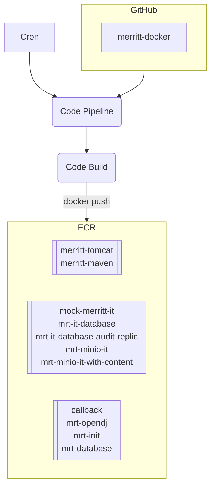
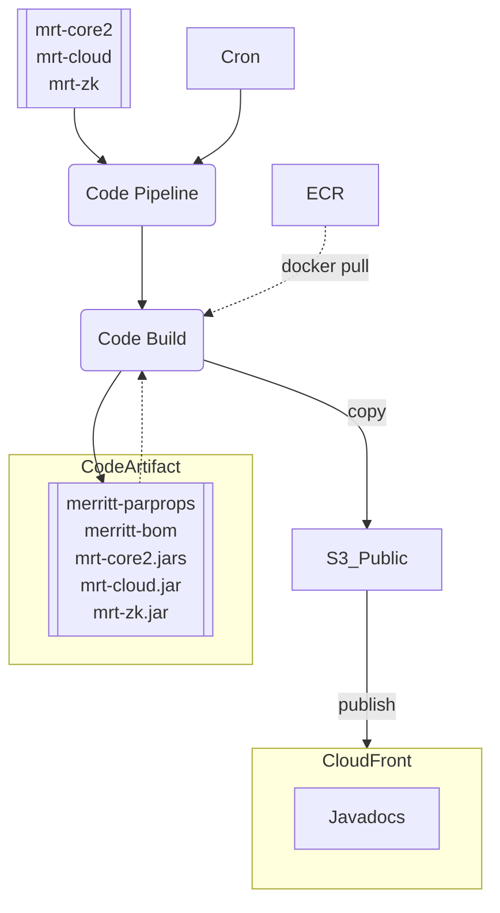
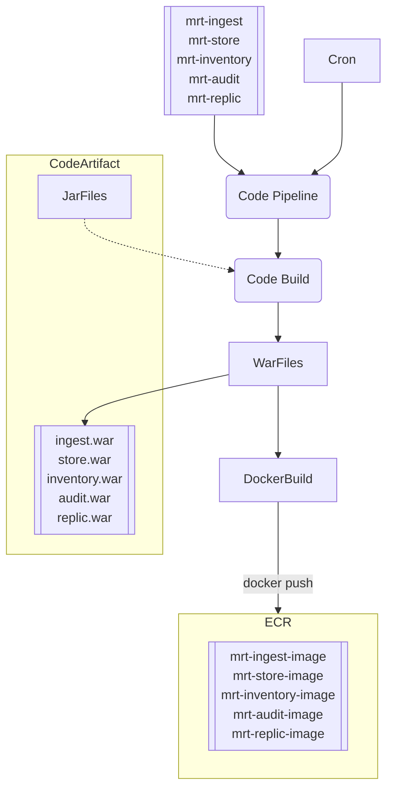
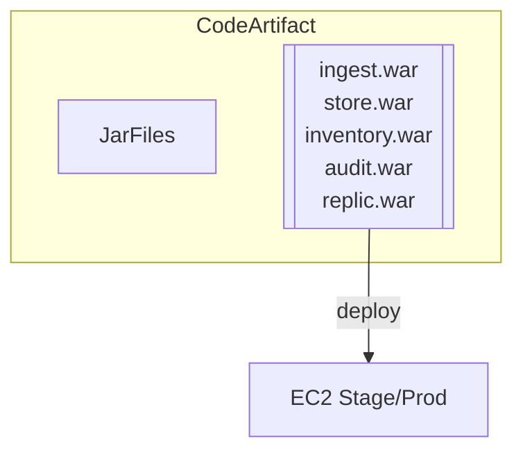
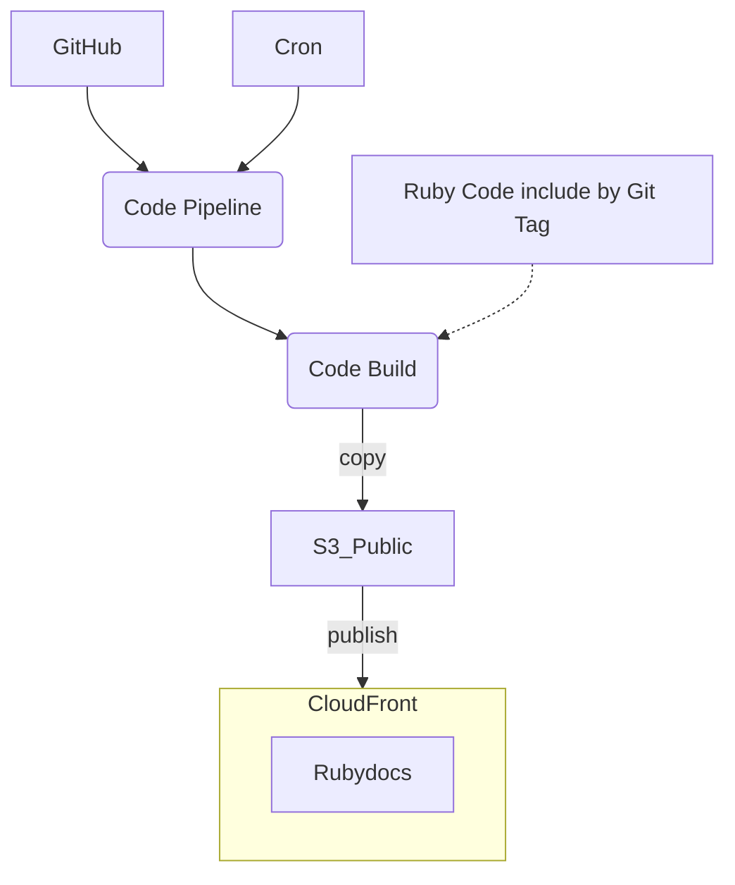
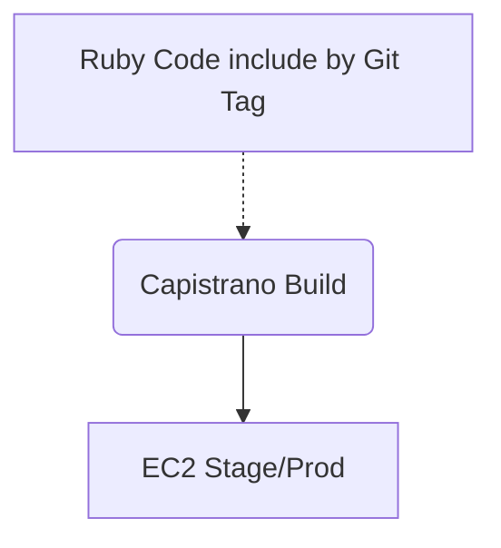
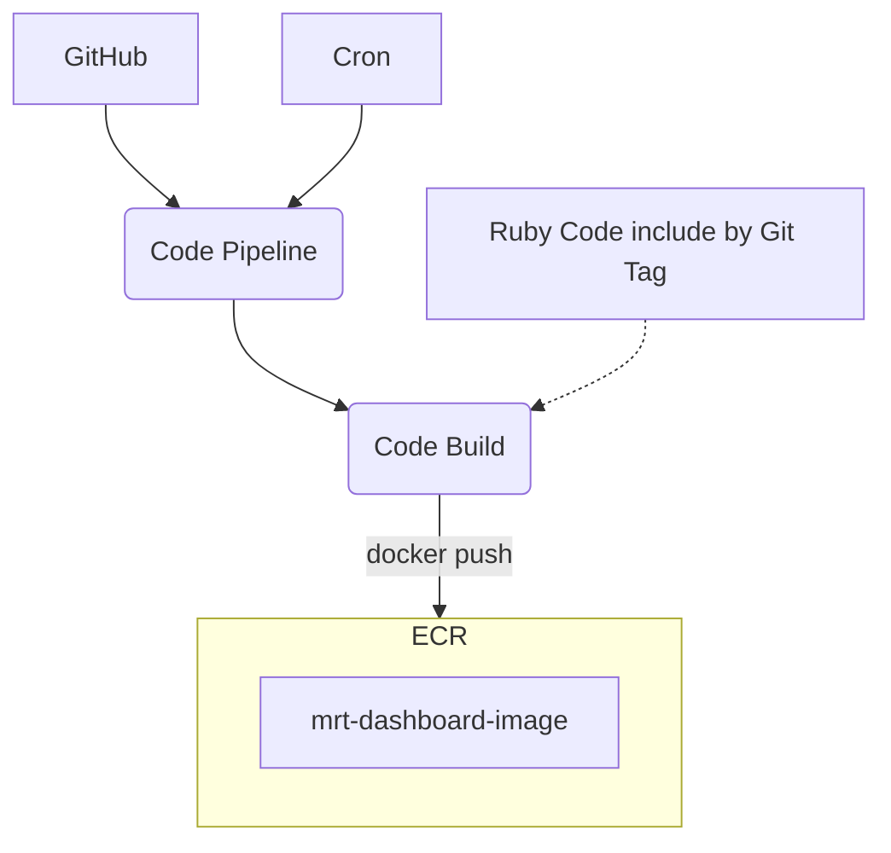
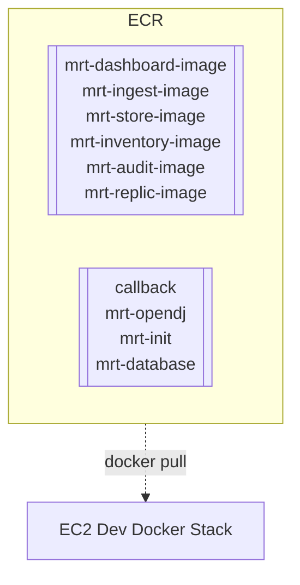
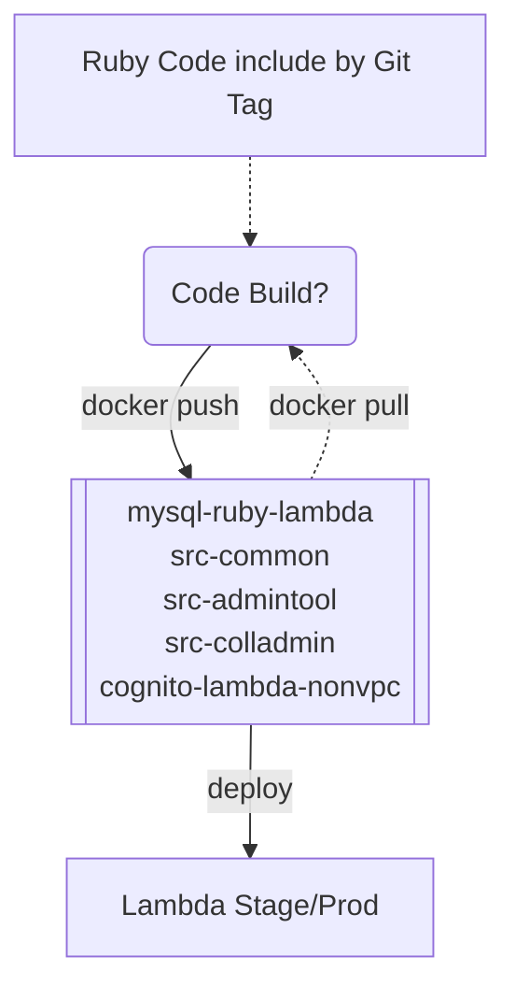

# AWS Build of Merritt Assets
- CloudFront: https://github.com/CDLUC3/mrt-doc/issues/1850
- CodeArtifact: https://github.com/CDLUC3/mrt-doc/issues/1931
- ECR: https://github.com/CDLUC3/mrt-doc/issues/1945
- Private Bucket:
  - https://github.com/CDLUC3/mrt-doc/issues/1923
  - https://github.com/CDLUC3/mrt-doc/issues/1924
 
## Tagging Ideas
- [Tagging Ideas](tagging.md)

## Using CodeArtifact Resources in a Docker Build
- https://stackoverflow.com/questions/67426509/how-to-use-aws-codeartifact-within-a-dockerfile-in-awscodebuild

## Workflow

### Build Integration Test Images

- Triggered by commit to merritt-docker
- Triggered on demand

### Java Libraries
- Triggered by commit to repo
- Triggered on demand

### Java Services (WAR)

### Java Service Deployment

### Ruby Library Build

### Ruby Service Deploy

### Ruby Service Build Image

---

### Run Docker Stack

---

### Ruby Lambda Build and Deploy

---

### Documentation and Web Assets

---

### Private Config Data - Evolve From File System Copy

## Anticipated Outputs
- https://merritt.uc3dev.cdlib.org/index.html
  - [html source](https://github.com/CDLUC3/merritt-tinker/blob/main/aws/uc3-mrt-devresources/index.html)

