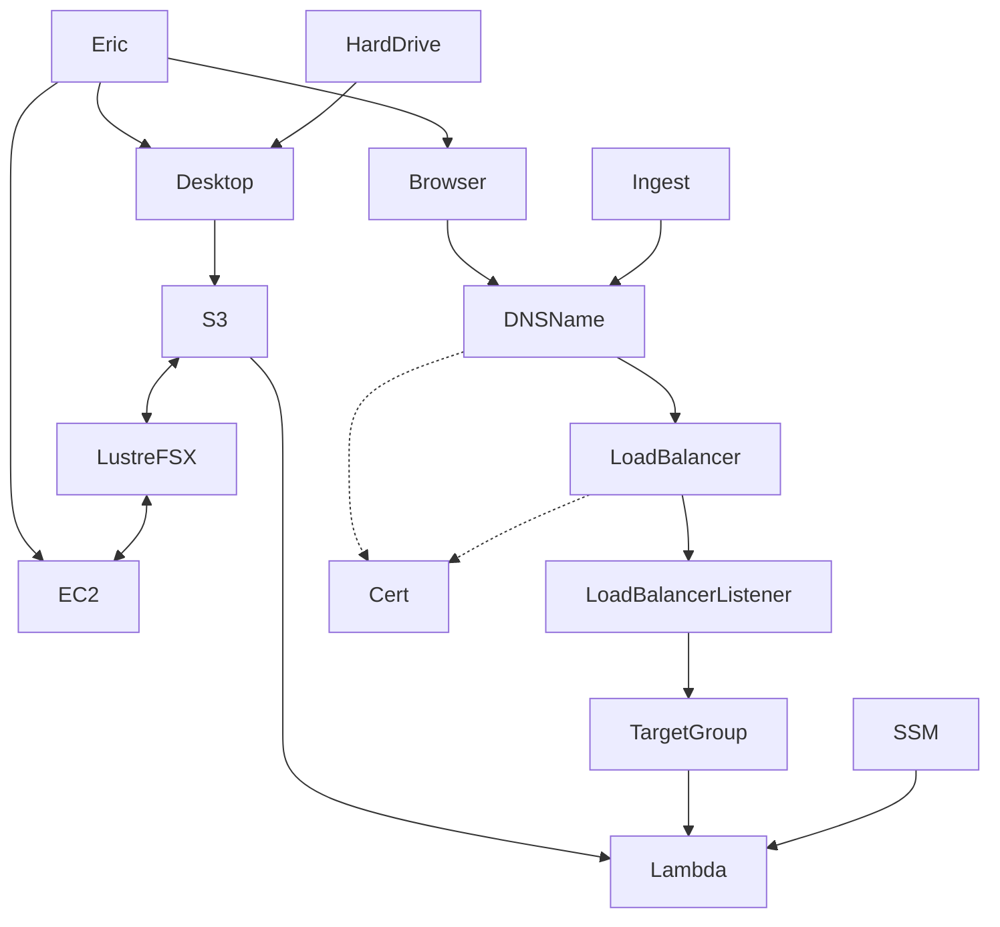

# Content Ingest Workspace Design

## Workspace Domain
- Content may be ingested into either Stage or Prod.

## File System

~ZFS/EFS file systems should be mounted and unmounted as projects are started and completed.~

Options
- Bring up a large i3en with a big volume and serve up content over http.  Volume will need backed up.
- Create a dedicated EBS volume on a batch server (size can be configurable)

All content should be accessible to CDL servers by URL.

Moderately performant to ingest.

- Merritt Box process should write to the workspace
- Any hard drives that are sent to Merritt should be copied to this workspace

If no active content projects are in process, the environment should scale down to minimal costs.

Consider a 2TB workspace, separate from the shared ZFS to upload incoming content to.

File system should be mounted to the PROD and STAGE ingest servers as well as DEV servers for manifest creation.

Merritt manifests will pull content with `http://` URLs.

## Compute Environment

Activities
- Run zips
- Run checksums
- Generate manfiests

Options
- re-use the batch servers (may need to evaluate instance type)
- provision a special batch server on demand
  - get IAS' opinion
  - ideally Eric could run a command to provision on-demand
  - IAS requests would be needed to re-size
  - Example: up for 6 weeks, then down for 6 weeks
- minimal scratch space
  - scripts and tools should persist in source code manifest 

## Cost Considerations
Consider how to charge back or estimate the cost of running this environment for a campus.

## Cloud Storage

Dedicated cloud buckets should be accessible to this environment.  These should be separate from Merritt buckets.

- Snowcone content can be loaded to these buckets
- Other types or replication to these bucket could be implemented
- New tools supporting bulk presigned upload could use these buckets.

All cloud content should be accessible to CDL servers by URL using the tools that Ashley built (for Jepson and PalMu).  
The PalMu ingest code might also be informative.

## Workspace Code

We are simulating campus depositor activity from this environment.  We should use this environment as a test ground to validate the depositor tools that we provide to campuses.

### Ingest Tools
A generic library of code should be written to facilitate the creation of ingest manifests within this environment.

Because any file created in this environment will be web accessible, it should be be relatively easy to create manifests of manifests.

Perhaps some of these tools could eventually be packaged as depositor tools.

### QA Tools
A generic set of QA tools should be written to ensure that 100% of content has been loaded.

These tools should purge content from the enviroment as ingestion is completed.

## Developer Practices

Tools should be written so that any Merritt team member can execute them.  

Tools should be written to be modified by multiple team members.

Following conventions, tools should be written in Ruby

## Depositor Guidelines

Guidelines should be written for depositors to encourage common file and folder hierarchies that in turn dovetail with Ingest Tool expectations.

These should also document recommended practices for naming conventions and use of Local IDs.

## Reporting

Reporting tools should be written to estimate the costs of content waiting to be ingested 
into Merritt and to ensure that content efforts do not languish.
