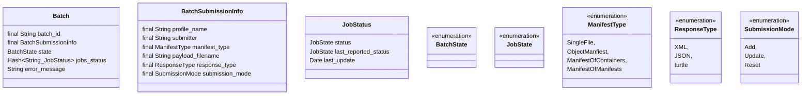
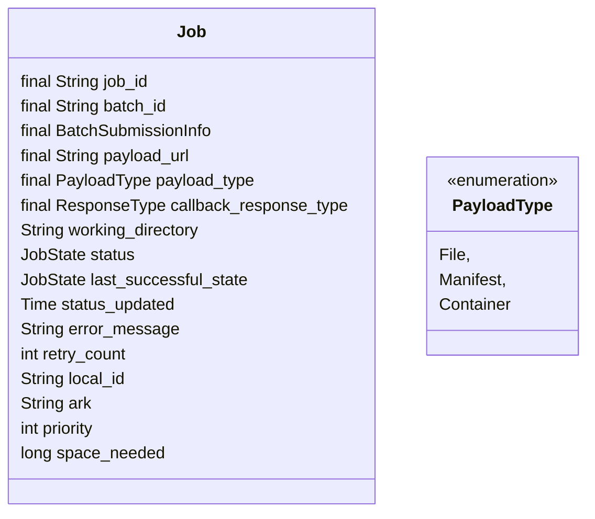

# Queue Data

- [Design](README.md)

## Queue Data

### Space Considerations
> ZooKeeper was not designed to be a general database or large object store. Instead, it manages coordination data. This data can come in the form of configuration, status information, rendezvous, etc. A common property of the various forms of coordination data is that they are relatively small: measured in kilobytes. The ZooKeeper client and the server implementations have sanity checks to ensure that znodes have less than 1M of data, but the data should be much less than that on average. [^1]
[^1]: https://zookeeper.apache.org/doc/r3.3.3/zookeeperProgrammers.html#Data+Access

#### Final vs Volatile data fields
- As we write to zookeeper, should be distinguish our static fields (submitter, file name) from the volatile fields (status, space_needed, last update)?

## Design Ideas

| Zookeeper Node Path | Node Data Type | Fields | Created By | Modified By | Comment |
| - | - | - | - | - | - |
| /batches/BID/lock | none | - | Pending, Reporting | - | **Ephemeral node** to lock a batch, deleted by the thread that creates the node |
| /batches/BID/submission | json | profile_name submitter payload_filename  erc_what erc_who erc_when erc_where type submission_mode | creation | none | |
| /batches/BID/status | json | status last_modified | creation | all jobs done | | 
| /batches/BID/status-report | json | failed_jobs | failure | failure | last status report sent to user | 
| /batches/BID/states/STATE/JID | none | - | | | STATE = pending / held / processing / failed / completed Create watcher to watch for states/processing to be empty| 
| /batches/BID/lock | none | - | Several states | - | **Ephemeral node** to lock a job, deleted by the thread that creates the node |
| /jobs/JID/bid | string | batch_id | creation | none | |
| /jobs/JID/configuration | json | batch_id profile_name submitter payload_url payload_type response_type working_dir local_id | creation | none | |
| /jobs/JID/status | json | status last_successful_status last_modification_date retry_count | creation | none | |
| /jobs/JID/priority | int | - | creation | estimating | |
| /jobs/JID/space_needed | long | - | creation | estimating | |
| /jobs/JID/identifiers | json | primary_id local_id: [] | creation | processing | |
| /jobs/states/STATE/PP-JID | none | - | | | PP = priority  STATE = pending / held / estimating / provisioning / downloading / processing / recording / notify / failed / completed |

### Job Transition

- Processing /jobs/states/StateX/PP-JID
- Job finishes StateX
- Update /jobs/JID/status data
  - last_successful_status = StateX
  - status = StateY
  - last_modification_date = now
- Delete /jobs/states/StateX/PP-JID
- Create /jobs/states/StateY/PP-JID
  - Note: The prior state might have altered the priority
- If StateY == Completed
  - Delete /batches/BID/states/processing/JID
  - Create /batches/BID/states/completed/JID
- If StateY == Failed
  - Delete /batches/BID/states/processing/JID
  - Create /batches/BID/states/failed/JID
- If /batches/BID/states/processing is empty, watcher will trigger batch notification

## Batch Data

### Batch Object Data Elements

### Enum
- [BatchState.java](https://github.com/CDLUC3/merritt-tinker/blob/main/state-transition/src/main/java/org/cdlib/mrt/BatchState.java)

## Job Data

### Job Queue Data Elements

### Enum
- [JobState.java](https://github.com/CDLUC3/merritt-tinker/blob/main/state-transition/src/main/java/org/cdlib/mrt/JobState.java)

### Questions
- Store timing info

---
## Legacy Zookeeper Data Structure

### Record Data
- Ingest currently serializes java properties
- Inventory currently serializes XML data

### Record Keys
The ingest service currently packs a priority value into the path name for the zookeeper record.
- /ingest/mrtQ-02100000000003
- (document the component parts here)
- Question: priority may become a more dynamic property in the future
  - We could have a baseline priority in the pathname (for sorting) and an actual priority in the payload
  - We could also explore renaming a path dynamically when a priority change is appropriate

### Record Sorting

#### Current Implementation
In Merritt's current zookeeper implementation, record headers contain binary data.
- Status: 1 byte status field with each byte representing a different queue state
- Time: 8 byte long representing the number of seconds since 1970
