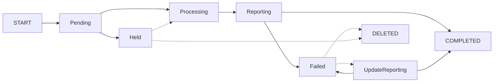
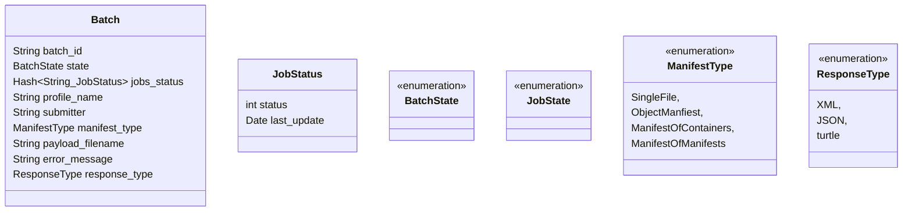
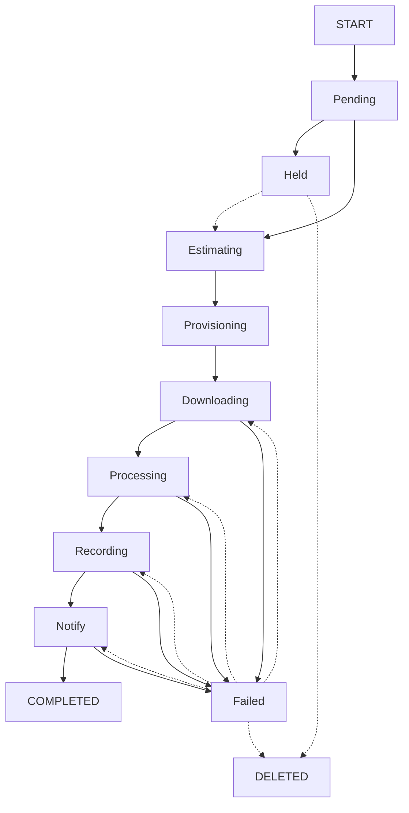

# Queue States

- [Design](README.md)

## Batch Queue

### States

### Data Elements

### State Transitions
- (None) --> Pending
  - generate batch_id
    - create batch folder
    - write payload to batch folder
    - TODO: we should re-evaluate the maximum payload size without a manifest (currently 30G)
  - set profile_name
  - set submitter
  - determine manifest_type
  - set file_name 
  - examine the payload
    - single - 1 job batch
    - object manifest - 1 job batch
    - manifest of manifest - N jobs
    - manifest of zips - N jobs
    - manifest of jobs - N jobs
    - future json manifest (inline manifest of detailed object manifests)
  - status = Pending 
- Pending --> Held
  - check if collection is held
  - status = Held 
- Pending --> Processing
  - status = Processing 
- Held --> Processing (admin function)
  - status = Processing 
- Processing --> Failed
  - status = Failed
  - set error_message 
- Processing --> Reporting
  - based on the payload
    - single - we start a 1 job batch
    - object manifest - we start a 1 job batch
    - manifest of manifest - create N job entries and create the array of jobids in the batch object
    - manifest of zips - create N job entries and create the array of jobids in the batch object
  - construct JOB object(s)
  - construct job folder(s)
    - folder creation could be defererred to the job step 
  - create jobs in job queue
  - we create status array
  - status = Reporting
- Reporting --> Completed
  - send summary email
  - status = Completed
- Reporting --> Failed
  - this occurs when at least one job has occurred
  - status =  Failed
  - or is a batch done after it reports
    - if jobs are re-run do they report on their own?
    - do we create a "re-run batch"?
    - or is this a question for the end users? 
- Failed --> UpdateReporting
  - manually triggered if some or all of the jobs have been re-run 
  - status = UpdateReporting 
- UpdateReporting --> Completed
  - detect any updated statuses and report them
  - status = Completed
- UpdateReporting --> Failed
  - detect any updated statuses and report them
  - status = Completed
- Failed --> Deleted (admin function)
  - status = Deleted 
- Held --> Deleted (admin function) 
  - status = Deleted 

## Job Queue

### States

- pending
- held - can jobs and batches be HELD? Yes
- estimating - HEAD requests to calculate size
- provisioning - once dynamic provisioning is implemented (ie zfs provisioning)
  - if working storage is more than 80% full, then wait 
  - otherwise, use default working storage 
- downloading - one or more downloads is in progress
- processing - all downloads complete, checksum check, mint identifiers, notify storage
- recording - storage is complete, notify inventory
- notify - invoke callback if needed, notify batch handler
- completed - storage and inventory are complete, cleanup job folder
- failed
  - resume downloading
  - resume processing
  - resume recording
  - resume notify

### Data Elements
- String payload_url (http: or file:)
- int payload_type (file, manifest, container - zip)
- String payload_version
- String profile_name
- int status
- int last_successful_state (for restart from failed state)
- date status_updated - time of last status change
- String batch_id
- String job_id
- String workding_directory - full path to content
  - this could allow us to temporarily provision file systems (zfs) for exceptionally large ingest projects
  - if space is tight, a null value indicates using the default working file system
- int retry_count
  - meaning of retry varies based on state - this values implies a deliberate requeue (not retry logic in code)
- String local_id
- String ark
- int priority
- String submitter
- boolean update_status (false - add, true - updated)
- String digest_type
- String digest_value
- long space_needed (for a single object)
- String resource_to_provision (null allowed)
- ? response_type? - only if needed for callback operation
- String error_message

### State Transitions
- (None) --> Pending
  - if payload is a single file and the depositor supplied a digest, perform checksum validation 
  - payload_version (hard coded)
  - profile_name - constructor
  - status = Pending
  - batch_id - constructor
  - job_id - generated
  - workding_directory - derived from batch & job (evenually more flexible options)
  - retry_count = 0
  - priority - derived from
    - profile
    - size of the batch (constructor)
  - payload_type - constructor
  - payload_url - constructor
  - submitter - constructor
  - update_status - constructor
  - digest_type - constructor (optional)
  - digest_value - constructor (optional)
  - space_needed = 0
  - resource_to_provision - constructor
  - local_id - constructor (read from ERC, from form parameter, or from manifest)
  - ark - constructor (if supplied at ingest time, otherwise it will be minted)
- (None) --> Failed
  - if payload digest does not match depositor digest
  - if manifest is corrupt
  - status = Failed (no recovery is possible)
- Pending --> Held
  - evaluate if a collection hold is in place 
  - status = Held 
- Pending --> Estimating
  - status = Estimating 
- Held --> Estimating (admin function) 
  - evaluate if collection hold has been removed
  - status Estimating   
- Estimating --> Provisioning
  - HEAD request on every download that is needed (multi-thread)
  - sum value into space_needed
  - last_successful_state = Estimating
  - status = Provisioning
- Provisioning --> Downloading
  - if last_successful_state is not Estimating, total may be inaccurate
  - determine if file system is available
  - determine if there is adequate storage to proceed (throttle at 70% full disk)
  - if space is sufficent state=Downloading  
- Downloading --> Processing
  - GET request on every download (multi-threaded), with a finite number of retries
  - save files to working folder
  - recalculate space_needed (in case estimate was inaccurate)
  - perform digest validation (if user-supplied in manifest)
  - last_successful_state = Downloading
  - status = Processing
- Downloading --> Failed (downloading)
  - status = Failed
  - last_successful_state remains Estimating
  - error_message = details the file that could not be downloaded 
- Processing --> Recording
  - Local_id lookup
  - Mint ark using EZID if needed
  - if local_id does not match user-supplied ark, fail
  - Set ark
  - Question: should we break Minting into a separate state
    - small risk of wasting an ark if the minting process is rerun (only applicable if no localid is provided) 
  - Write ERC file
  - Write dublin_core file
  - Check digest for each file if needed (HandlerDigest)
  - Create storage manifest (HandlerDigest)
  - Request storage worker for handling request (very low risk of failure)
  - Call storage enpoint to pass storage manifest
  - Check return status from storage
  - last_sucessful_state = Processing
  - status = Recording
- Processing --> Failed (processing)
  - due to minting failure or storage failure
  - update error_message 
  - status = Failed   
- Recording  --> Notify
  - Inventory will read and update THIS queue
  - Save data to INV database
  - status = Notify
  - last_sucessful_state = Recording
- Recording --> Failed (recording)
  - update error_message 
  - status = Failed
- Notify --> Completed
  - Invoke callback (if defined)
  - Notify batch queue that job is complete
  - Status = Completed  
  - last_sucessful_state = Notify
- Notify --> Failed 
  - status = Failed
- Failed --> Downloading
  - reset status 
- Failed --> Processing
  - reset status 
- Failed --> Recording
  - reset status 
- Failed --> Notify
  - reset status 
- Failed --> Deleted (admin function)

## Use Cases

### Successful Batch
- User submits manifest with 3 items
- Batch downloads manifest and creates 3 jobs
  - Batch: Processing
  - Job 1: Pending
  - Job 2: Pending
  - Job 3: Pending
- Job 2 completes  
  - Batch: Processing
  - Job 1: Pending
  - Job 2: Complete
  - Job 3: Pending
- Job 3 completes  
  - Batch: Processing
  - Job 1: Pending
  - Job 2: Complete
  - Job 3: Complete
- Job 1 completes  
  - Batch: Processing
  - Job 1: Complete
  - Job 2: Complete
  - Job 3: Complete
- Batch goes to Reporting State
  - Batch: Reporting
  - success email sent to depositor
- Batch goes to Completed State   

- document key use cases
- esp retry logic

### Failed Batch
- User submits manifest with 3 items
- Batch downloads manifest and creates 3 jobs
  - Batch: Processing
  - Job 1: Pending
  - Job 2: Pending
  - Job 3: Pending
- Job 2 completes  
  - Batch: Processing
  - Job 1: Pending
  - Job 2: Complete
  - Job 3: Pending
- Job 3 fails  
  - Batch: Processing
  - Job 1: Pending
  - Job 2: Complete
  - Job 3: Failed
- Job 1 completed  
  - Batch: Processing
  - Job 1: Complete
  - Job 2: Complete
  - Job 3: Failed
- Batch goes to Reporting State
  - Batch: Reporting
  - failed email sent to depositor
- Batch goes to Failed State   

### Failed Batch with Retry
- User submits manifest with 3 items
- Batch downloads manifest and creates 3 jobs
  - Batch: Processing
  - Job 1: Pending
  - Job 2: Pending
  - Job 3: Pending
- Job 2 completes  
  - Batch: Processing
  - Job 1: Pending
  - Job 2: Complete
  - Job 3: Pending
- Job 3 fails  
  - Batch: Processing
  - Job 1: Pending
  - Job 2: Complete
  - Job 3: Failed
- Job 1 completed  
  - Batch: Processing
  - Job 1: Complete
  - Job 2: Complete
  - Job 3: Failed
- Batch goes to Reporting State
  - Batch: Reporting
  - failed email sent to depositor
- Batch goes to Failed State
  - Batch: Failed 
  - Job 1: Complete
  - Job 2: Complete
  - Job 3: Failed
- Job 3 restarted
  - Batch: Failed 
  - Job 1: Complete
  - Job 2: Complete
  - Job 3: Processing*
- Job 3 completes
  - Batch: Failed 
  - Job 1: Complete
  - Job 2: Complete
  - Job 3: Complete*
- Batch set to UpdateReporting
  - Batch: UpdateReporting
  - email update to depositor to reflect change in Job 3 status
- Batch set to Complete
  - Complete   
