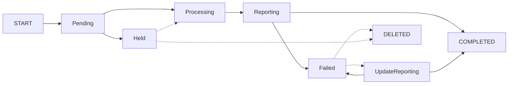
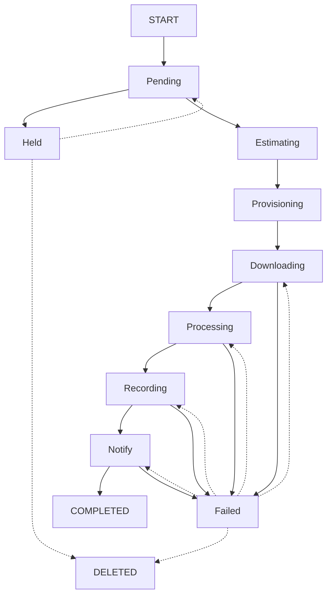

# Queue States

- [Design](README.md)

## Batch Queue

### Batch Queue State Diagram

---
## Batch Queue States
_A dashed line indicates and administrative action initiated by the Merritt Team_

### Pending
Batch is ready to be processed
### Held
Collection is HELD.  The hold must be released before the batch can proceed.
### Processing
Payload is analyzed.  If the payload is a manifest, it will be downloaded. Jobs are created in the job queue.
### Reporting
All jobs have COMPLETED or FAILED, a summary e-mail is sent to the depositor.
### COMPLETED
All jobs COMPLETED
### Failed
At least one job FAILED
### UpdateReporting
Determine if any previously FAILED jobs are not complete.  If so, notify the depositor by email.

---
## Job Queue

### Job Queue State Diagram

---
## Job Queue States
### Pending
Job is waiting to be acquired by the queue
### Held
Since Job was queued, the collection has been put into a HELD state.  The job will require an administrateive action to release it after the hold is released.
### Estimating
Perform HEAD requests for all content to estimate the size of the ingest.  If HEAD requests are not supported, no value is updated and the job should proceed with limited information.  This could potentially affect priority for the job
### Provisioning
Once dynamic provisioning is implemented (ie zfs provisioning), wait for dedicated file system to be provisioned.

If not dedicated file system is specified, use default working storage.
- if working storage is more than 80% full, then wait 
- otherwise, use default working storage 
### Downloading
One or more downloads is in progress.  This can be a multi-threaded step.  Threads are not managed in the queue.
### Processing
All downloads complete; perform Merritt Ingest
- validiate checksum check
- mint identifiers
- create system files
- notify storage
### Recording
Storage is complete; ready for Inventory.
The Inventory service will operate on this step.
### Notify
Invoke callback if needed
Notify batch handler that the job is complete
### COMPLETED
Storage and inventory are complete, cleanup job folder
### Failed
The queue will track the last successful step so that the job can be resumed at the appropriate step.

---

## Design Questions

- Should we have separate states for "Active Provisioning" vs "Capacity Checks"?
- Should each job know about its list of downloads so that the download step could be resumed at a specific point?
- 
- reset status 
### Failed --> Notify
- reset status 
### Failed --> Deleted (admin function)
