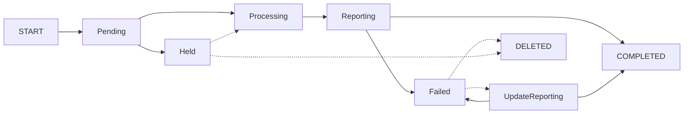
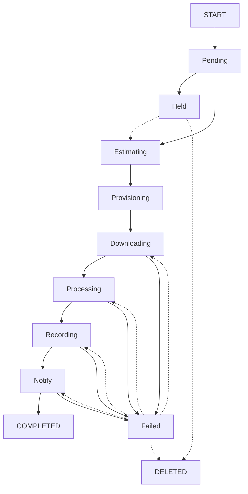

# Queue States

- [Design](README.md)

## Batch Queue

### Batch Queue State Diagram

---
## Batch Queue States
_A dashed line indicates and administrative action initiated by the Merritt Team_

### Pending
Batch is ready to be processed
### Held
Collection is HELD.  The hold must be released before the batch can proceed.
### Processing
Payload is analyzed.  If the payload is a manifest, it will be downloaded. Jobs are created in the job queue.
### Reporting
All jobs have COMPLETED or FAILED, a summary e-mail is sent to the depositor.
### COMPLETED
All jobs COMPLETED
### Failed
At least one job FAILED
### UpdateReporting
Determine if any previously FAILED jobs are not complete.  If so, notify the depositor by email.

---

## Batch Queue State Transitions

### Start --> Pending
- generate batch_id
  - create batch folder
  - write payload to batch folder
  - TODO: we should re-evaluate the maximum payload size without a manifest (currently 30G)
- set profile_name
- set submitter
- determine manifest_type
- set file_name 
- examine the payload
  - single - 1 job batch
  - object manifest - 1 job batch
  - manifest of manifest - N jobs
  - manifest of zips - N jobs
  - manifest of jobs - N jobs
  - future json manifest (inline manifest of detailed object manifests)
- status = Pending 
### Pending --> Held
- check if collection is held
- status = Held 
### Pending --> Processing
- status = Processing 
### Held --> Processing (admin function)
- status = Processing 
### Processing --> Failed
- status = Failed
- set error_message 
### Processing --> Reporting
- based on the payload
  - single - we start a 1 job batch
  - object manifest - we start a 1 job batch
  - manifest of manifest - create N job entries and create the array of jobids in the batch object
  - manifest of zips - create N job entries and create the array of jobids in the batch object
- construct JOB object(s)
- construct job folder(s)
  - folder creation could be defererred to the job step 
- create jobs in job queue
- we create status array
- status = Reporting
### Reporting --> Completed
- send summary email
- status = Completed
### Reporting --> Failed
- this occurs when at least one job has occurred
- status =  Failed
- or is a batch done after it reports
  - if jobs are re-run do they report on their own?
  - do we create a "re-run batch"?
  - or is this a question for the end users? 
### Failed --> UpdateReporting
- manually triggered if some or all of the jobs have been re-run 
- status = UpdateReporting 
### UpdateReporting --> Completed
- detect any updated statuses and report them
- status = Completed
### UpdateReporting --> Failed
- detect any updated statuses and report them
- status = Completed
### Failed --> DELETED (admin function)
- delete any running jobs (and folders)
- delete batch folder
- status = Deleted 
### Held --> Deleted (admin function) 
- delete any running jobs (and folders)
- delete batch folder
- status = DELETED

---
## Job Queue

### Job Queue State Diagram

---
## Job Queue States
### Pending
Job is waiting to be acquired by the queue
### Held
Since Job was queued, the collection has been put into a HELD state.  The job will require an administrateive action to release it after the hold is released.
### Estimating
Perform HEAD requests for all content to estimate the size of the ingest.  If HEAD requests are not supported, no value is updated and the job should proceed with limited information.  This could potentially affect priority for the job
### Provisioning
Once dynamic provisioning is implemented (ie zfs provisioning), wait for dedicated file system to be provisioned.

If not dedicated file system is specified, use default working storage.
- if working storage is more than 80% full, then wait 
- otherwise, use default working storage 
### Downloading
One or more downloads is in progress.  This can be a multi-threaded step.  Threads are not managed in the queue.
### Processing
All downloads complete; perform Merritt Ingest
- validiate checksum check
- mint identifiers
- create system files
- notify storage
### Recording
Storage is complete; ready for Inventory.
The Inventory service will operate on this step.
### Notify
Invoke callback if needed
Notify batch handler that the job is complete
### COMPLETED
Storage and inventory are complete, cleanup job folder
### Failed
The queue will track the last successful step so that the job can be resumed at the appropriate step.

---

## Job Queue State Transitions

### START --> Pending
- if payload is a single file and the depositor supplied a digest, perform checksum validation 
- profile_name - constructor
- status = Pending
- batch_id - constructor
- job_id - generated
- workding_directory - derived from batch & job (evenually more flexible options)
- retry_count = 0
- priority - derived from
  - profile
  - size of the batch (constructor)
- payload_type - constructor
- payload_url - constructor
- submitter - constructor
- update_status - constructor
- digest_type - constructor (optional)
- digest_value - constructor (optional)
- space_needed = 0
- resource_to_provision - constructor
- local_id - constructor (read from ERC, from form parameter, or from manifest)
- ark - constructor (if supplied at ingest time, otherwise it will be minted)

### START --> Failed
- if payload digest does not match depositor digest
- if manifest is corrupt
- status = Failed (no recovery is possible)
### Pending --> Held
- evaluate if a collection hold is in place 
- status = Held 
### Pending --> Estimating
- status = Estimating 
### Held --> Estimating (admin function) 
- evaluate if collection hold has been removed
- status Estimating   
### Estimating --> Provisioning
- HEAD request on every download that is needed (multi-thread)
- sum value into space_needed
- last_successful_state = Estimating
- status = Provisioning
### Provisioning --> Downloading
- if last_successful_state is not Estimating, total may be inaccurate
- determine if file system is available
- determine if there is adequate storage to proceed (throttle at 70% full disk)
- if space is sufficent state=Downloading  
### Downloading --> Processing
- GET request on every download (multi-threaded), with a finite number of retries
- save files to working folder
- recalculate space_needed (in case estimate was inaccurate)
- perform digest validation (if user-supplied in manifest)
- last_successful_state = Downloading
- status = Processing
### Downloading --> Failed (downloading)
- status = Failed
- last_successful_state remains Estimating
- error_message = details the file that could not be downloaded 
### Processing --> Recording
- Local_id lookup
- Mint ark using EZID if needed
- if local_id does not match user-supplied ark, fail
- Set ark
- Question: should we break Minting into a separate state
  - small risk of wasting an ark if the minting process is rerun (only applicable if no localid is provided) 
- Write ERC file
- Write dublin_core file
- Check digest for each file if needed (HandlerDigest)
- Create storage manifest (HandlerDigest)
- Request storage worker for handling request (very low risk of failure)
- Call storage enpoint to pass storage manifest
- Check return status from storage
- last_sucessful_state = Processing
- status = Recording
### Processing --> Failed (processing)
- due to minting failure or storage failure
- update error_message 
- status = Failed   
### Recording --> Notify
- Inventory will read and update THIS queue
- Save data to INV database
- status = Notify
- last_sucessful_state = Recording
### Recording --> Failed (recording)
- update error_message 
- status = Failed
### Notify --> Completed
- Invoke callback (if defined)
- Notify batch queue that job is complete
- Status = Completed  
- last_sucessful_state = Notify
- delete job folder
### Notify --> Failed 
- status = Failed
### Failed --> Downloading
- reset status 
### Failed --> Processing
- reset status 
### Failed --> Recording
- reset status
### Failed --> DELETED
- delete job folder
### Held --> DELETED
- delete job folder

---

## Design Questions

- Should we have separate states for "Active Provisioning" vs "Capacity Checks"?
- Should each job know about its list of downloads so that the download step could be resumed at a specific point?
- 
- reset status 
### Failed --> Notify
- reset status 
### Failed --> Deleted (admin function)
