# Batch Queue Use Cases

- [Design](README.md)

## Use Case: Successful Batch

### User submits manifest with 3 items

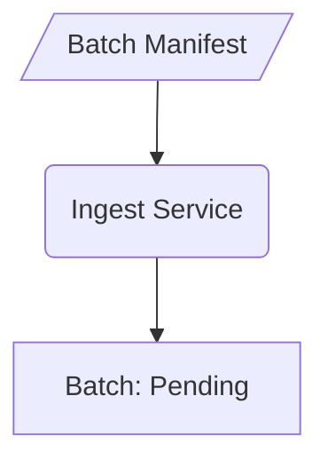

### Batch Queue starts Batch


### Batch downloads manifest and creates 3 jobs

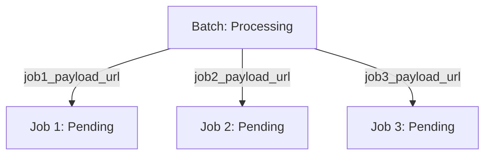

### Jobs Begin
  
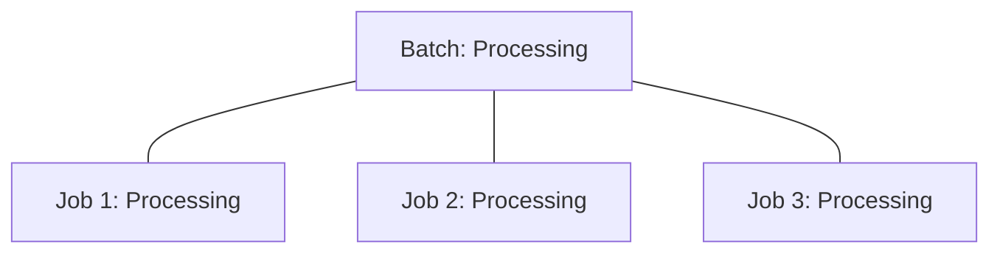

### Job 2 Completes
  
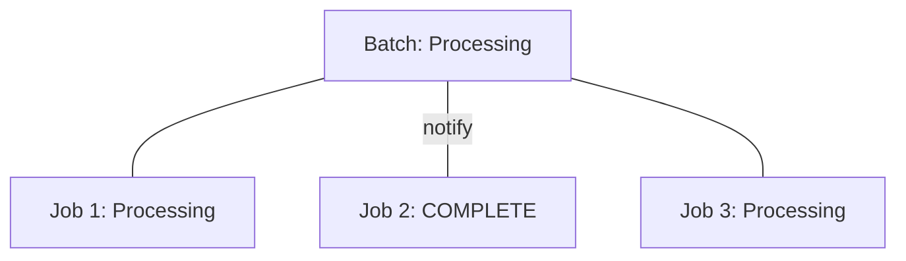
### Job 3 completes  
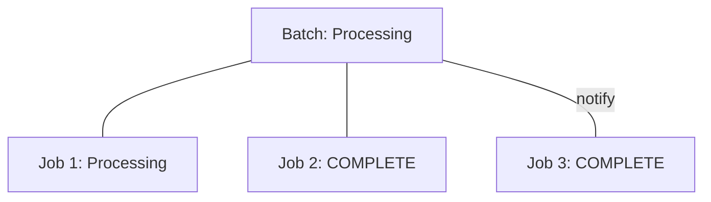

### Job 1 completes  
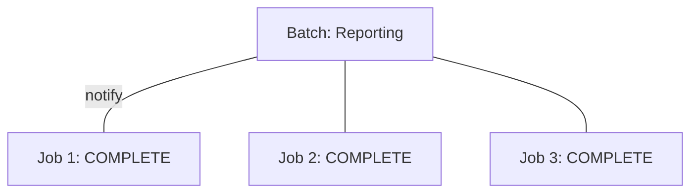

### Batch Reports Job Status to Depositor 
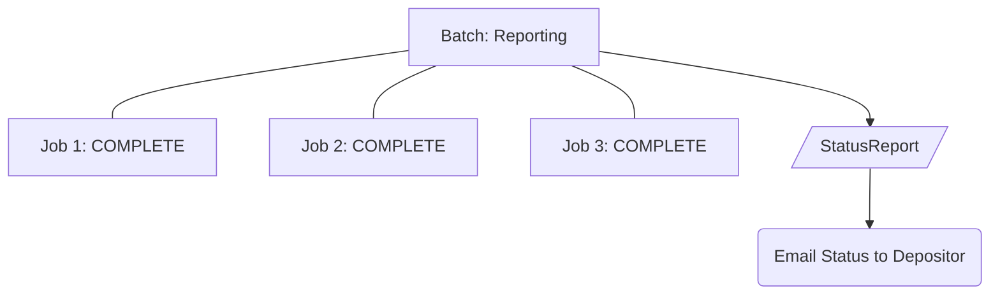

### Batch Completes


##  Use Case: Failed Batch

### User submits manifest with 3 items


### Batch Queue starts Batch


### Batch downloads manifest and creates 3 jobs


### Jobs Begin
  


### Job 2 Completes
  

### Job 3 fails  
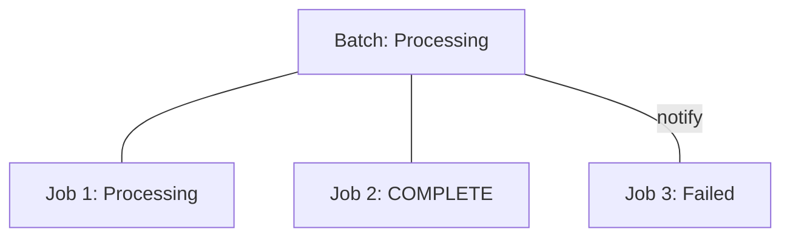

### Job 1 completes  
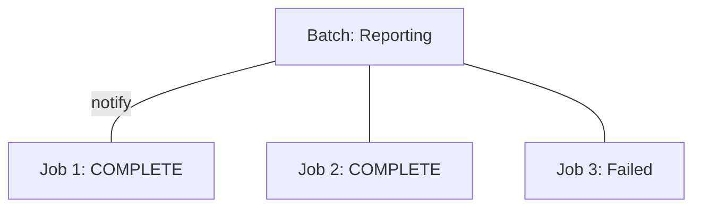

### Batch Reports Job Status to Depositor 
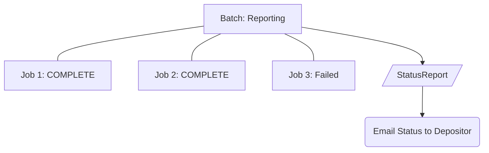

### Batch Goes to Failed state
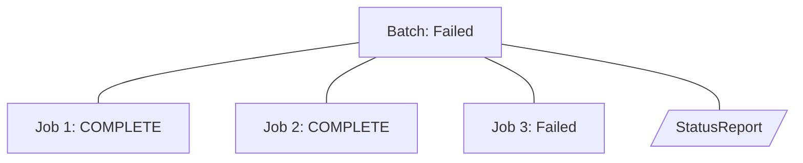


### Admin Deletes Batch after determining that resubmission of failed job is not possible


## Use Case: Failed Batch with Successful Retry


### User submits manifest with 3 items


### Batch Queue starts Batch

```mermaid
graph TD
  Batch[Batch: Processing]
```

### Batch downloads manifest and creates 3 jobs

```mermaid
graph TD
  Batch[Batch: Processing]
  Job1[Job 1: Pending]
  Job2[Job 2: Pending]
  Job3[Job 3: Pending]
  Batch --> |job1_payload_url| Job1
  Batch --> |job2_payload_url| Job2
  Batch --> |job3_payload_url| Job3
```

### Jobs Begin
  
```mermaid
graph TD
  Batch[Batch: Processing]
  Job1[Job 1: Processing]
  Job2[Job 2: Processing]
  Job3[Job 3: Processing]
  Batch --- Job1
  Batch --- Job2
  Batch --- Job3
```

### Job 2 Completes
  
```mermaid
graph TD
  Batch[Batch: Processing]
  Job1[Job 1: Processing]
  Job2[Job 2: COMPLETE]
  Job3[Job 3: Processing]
  Batch --- Job1
  Batch --- |notify| Job2
  Batch --- Job3
```
### Job 3 fails  
```mermaid
graph TD
  Batch[Batch: Processing]
  Job1[Job 1: Processing]
  Job2[Job 2: COMPLETE]
  Job3[Job 3: Failed]
  Batch --- Job1
  Batch --- Job2
  Batch --- |notify| Job3
```

### Job 1 completes  
```mermaid
graph TD
  Batch[Batch: Reporting]
  Job1[Job 1: COMPLETE]
  Job2[Job 2: COMPLETE]
  Job3[Job 3: Failed]
  Batch --- |notify| Job1
  Batch --- Job2
  Batch --- Job3
```

### Batch Reports Job Status to Depositor 
```mermaid
graph TD
  Batch[Batch: Reporting]
  Job1[Job 1: COMPLETE]
  Job2[Job 2: COMPLETE]
  Job3[Job 3: Failed]
  Batch --- Job1
  Batch --- Job2
  Batch --- Job3
  StatusReport[/StatusReport/]
  Email(Email Status to Depositor)
  Batch --> StatusReport
  StatusReport --> Email
```

### Batch Goes to Failed state
```mermaid
graph TD
  Batch[Batch: Failed]
  Job1[Job 1: COMPLETE]
  Job2[Job 2: COMPLETE]
  Job3[Job 3: Failed]
  Batch --- Job1
  Batch --- Job2
  Batch --- Job3
  StatusReport[/StatusReport/]
  Batch --- StatusReport
```

### Job 3 is restarted
```mermaid
graph TD
  Batch[Batch: Failed]
  Job1[Job 1: COMPLETE]
  Job2[Job 2: COMPLETE]
  Job3[Job 3: Processing]
  Batch --- Job1
  Batch --- Job2
  Batch --- Job3
  StatusReport[/StatusReport/]
  Batch --- StatusReport
```

### Job 3 completes
```mermaid
graph TD
  Batch[Batch: Failed]
  Job1[Job 1: COMPLETE]
  Job2[Job 2: COMPLETE]
  Job3[Job 3: COMPLETE]
  Batch --- Job1
  Batch --- Job2
  Batch --- |notify| Job3
  StatusReport[/StatusReport/]
  Batch --- StatusReport
```

### Admin changes batch state to UpdateReporting
```mermaid
graph TD
  Batch[Batch: UpdateReporting]
  Job1[Job 1: COMPLETE]
  Job2[Job 2: COMPLETE]
  Job3[Job 3: COMPLETE]
  Batch --- Job1
  Batch --- Job2
  Batch --- Job3
  StatusReport[/StatusReport/]
  Batch --- StatusReport
```

### Email is sent to depositor showing the status change for Job 3
```mermaid
graph TD
  Batch[Batch: UpdateReporting]
  Job1[Job 1: COMPLETE]
  Job2[Job 2: COMPLETE]
  Job3[Job 3: COMPLETE]
  Batch --- Job1
  Batch --- Job2
  Batch --- Job3
  StatusReport[/StatusReport/]
  Batch --> StatusReport
  StatusReport -.-> Batch
  Email(Email Status to Depositor)
  StatusReport --> Email
```

### Batch Status is COMPLETE
```mermaid
graph TD
  Batch[Batch: COMPLETE]
```

## Use Case: Failed Batch with Unsuccessful Retry


### User submits manifest with 3 items

```mermaid
graph TD
  Manifest[/Batch Manifest/]
  Ingest(Ingest Service)
  Batch[Batch: Pending]
  Manifest --> Ingest
  Ingest --> Batch
```

### Batch Queue starts Batch

```mermaid
graph TD
  Batch[Batch: Processing]
```

### Batch downloads manifest and creates 3 jobs

```mermaid
graph TD
  Batch[Batch: Processing]
  Job1[Job 1: Pending]
  Job2[Job 2: Pending]
  Job3[Job 3: Pending]
  Batch --> |job1_payload_url| Job1
  Batch --> |job2_payload_url| Job2
  Batch --> |job3_payload_url| Job3
```

### Jobs Begin
  
```mermaid
graph TD
  Batch[Batch: Processing]
  Job1[Job 1: Processing]
  Job2[Job 2: Processing]
  Job3[Job 3: Processing]
  Batch --- Job1
  Batch --- Job2
  Batch --- Job3
```

### Job 2 Completes
  
```mermaid
graph TD
  Batch[Batch: Processing]
  Job1[Job 1: Processing]
  Job2[Job 2: COMPLETE]
  Job3[Job 3: Processing]
  Batch --- Job1
  Batch --- |notify| Job2
  Batch --- Job3
```
### Job 3 fails  
```mermaid
graph TD
  Batch[Batch: Processing]
  Job1[Job 1: Processing]
  Job2[Job 2: COMPLETE]
  Job3[Job 3: Failed]
  Batch --- Job1
  Batch --- Job2
  Batch --- |notify| Job3
```

### Job 1 completes  
```mermaid
graph TD
  Batch[Batch: Reporting]
  Job1[Job 1: COMPLETE]
  Job2[Job 2: COMPLETE]
  Job3[Job 3: Failed]
  Batch --- |notify| Job1
  Batch --- Job2
  Batch --- Job3
```

### Batch Reports Job Status to Depositor 
```mermaid
graph TD
  Batch[Batch: Reporting]
  Job1[Job 1: COMPLETE]
  Job2[Job 2: COMPLETE]
  Job3[Job 3: Failed]
  Batch --- Job1
  Batch --- Job2
  Batch --- Job3
  StatusReport[/StatusReport/]
  Email(Email Status to Depositor)
  Batch --> StatusReport
  StatusReport --> Email
```

### Batch Goes to Failed state
```mermaid
graph TD
  Batch[Batch: Failed]
  Job1[Job 1: COMPLETE]
  Job2[Job 2: COMPLETE]
  Job3[Job 3: Failed]
  Batch --- Job1
  Batch --- Job2
  Batch --- Job3
  StatusReport[/StatusReport/]
  Batch --- StatusReport
```

### Job 3 is restarted
```mermaid
graph TD
  Batch[Batch: Failed]
  Job1[Job 1: COMPLETE]
  Job2[Job 2: COMPLETE]
  Job3[Job 3: Processing]
  Batch --- Job1
  Batch --- Job2
  Batch --- Job3
  StatusReport[/StatusReport/]
  Batch --- StatusReport
```

### Job 3 fails again
```mermaid
graph TD
  Batch[Batch: Failed]
  Job1[Job 1: COMPLETE]
  Job2[Job 2: COMPLETE]
  Job3[Job 3: Failed]
  Batch --- Job1
  Batch --- Job2
  Batch --- |notify| Job3
  StatusReport[/StatusReport/]
  Batch --- StatusReport
```

### Admin changes batch state to UpdateReporting
```mermaid
graph TD
  Batch[Batch: UpdateReporting]
  Job1[Job 1: COMPLETE]
  Job2[Job 2: COMPLETE]
  Job3[Job 3: Failed]
  Batch --- Job1
  Batch --- Job2
  Batch --- Job3
  StatusReport[/StatusReport/]
  Batch --- StatusReport
```

### Since there is no job state change since last report, no email is sent
```mermaid
graph TD
  Batch[Batch: UpdateReporting]
  Job1[Job 1: COMPLETE]
  Job2[Job 2: COMPLETE]
  Job3[Job 3: Failed]
  Batch --- Job1
  Batch --- Job2
  Batch --- Job3
  StatusReport[/StatusReport/]
  Batch --> StatusReport
  StatusReport -.-> Batch
```

### Batch Status is Failed
```mermaid
graph TD
  Batch[Batch: Failed]
  Job1[Job 1: COMPLETE]
  Job2[Job 2: COMPLETE]
  Job3[Job 3: Failed]
  Batch --- Job1
  Batch --- Job2
  Batch --- Job3
  StatusReport[/StatusReport/]
  Batch --> StatusReport
```

### Admin Deletes Batch after determining that resubmission of failed job is not possible
```mermaid
graph TD
  Batch[Batch: DELETED]
```
