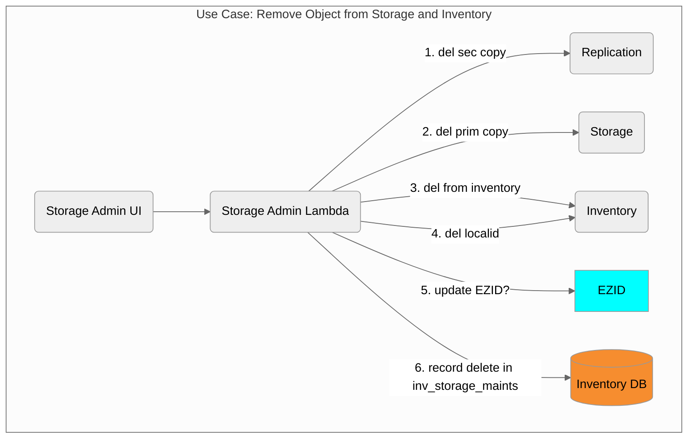
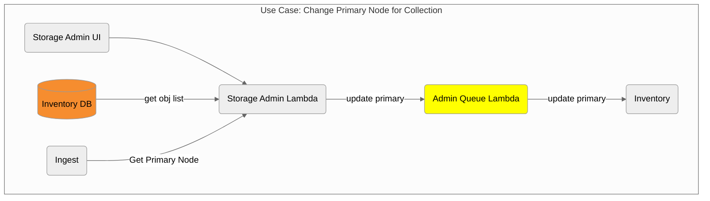

## Incomplete Storage Admin Efforts

### Delete Object



Steps to perform
- For each secondary
  - call Replic::objectDelete(node, ark)
- For primary
  - call Storage::objectDelete(node, ark)
  - Inventory::objectDelete(ark)
  - Inventory::localIdDelete(owner, localid)
- Create Tombstone entry for object
- Reflect deletion in daily billing stats

#### Tombstone Objects

```sql
create table inv_object_maints(
  id int,
  inv_object_id int,
  ark varchar(255),
  object_type enum('MRT-curatorial','MRT-system'),
  role enum('MRT-class','MRT-content'),
  aggregate_role enum('MRT-collection','MRT-owner','MRT-service-level-agreement','MRT-submission-agreement','MRT-none')
  version_number smallint,
  erc_who mediumtext,
  erc_what mediumtext,
  erc_when mediumtext,
  erc_where mediumtext,
  created timestamp,
  action enum('removed', 'recreated', 'modified-by-merritt', 'maintenance-note')
  modified timestamp,
  removed timestamp,
  note mediumtext
)
```

### Change Primary Storage Node



### Update Manifest Option

This is a speculative feature.  This would allow the Merritt System to provide a mechanism to generate a new manifest file for an object that works around system limitations.

This could also be used to clean up issues with obsolete system files.

Allow the upload of a repaired manifest for an object.

Correspondingly, a "get-augmented-manifest" option would exist to generate a repaired manifest with Merritt software.

### Ideas regarding Nodes and Ownership
- In order to facilitate management of content within a given time frame (e.g. 5 years), it may be beneficial to establish new buckets that are owner-specific.
- Potential content retention periods would establish a time frame for a collection.
- Prepayment for collection storage is a motivating factor. 
- The concept of ownership for new collections could be baked into object keys, where an owner name would appear as part of the key.
- Additional nodes add complexity, but could also allow for further flexibility in terms of primary/secondary node specification and reassignment.
- Additional thoughts/questions
  - Features are needed to allow for the update of an object owner and and object collection
  - If we introduce new bucket types, how can we facilitate the transfer of content from a default bucket to a specialized bucket
  - How can we register new "buckets" dynamically without re-deploying code?
  - Think about Dryad deletion, how can we deactive fixity checks and object updates for a subset of content.


---

[Completed Storage Admin Features](completed.md)
