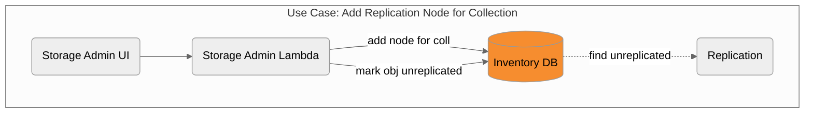
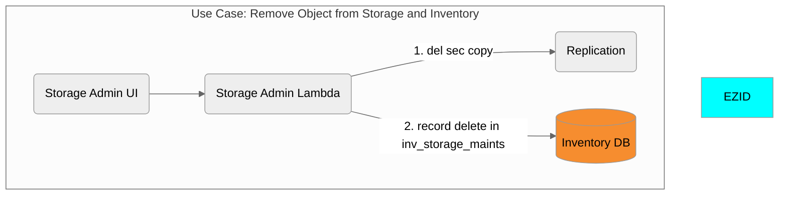
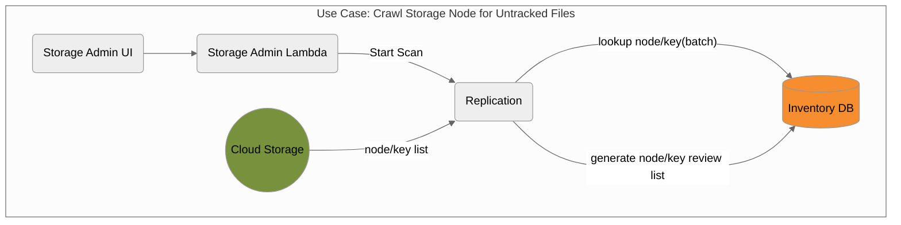
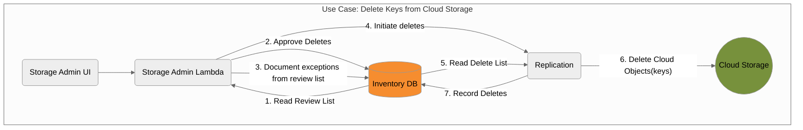
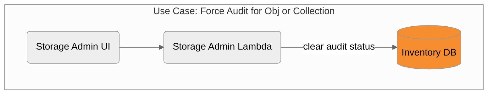

## Incomplete Storage Admin Efforts

### Delete Object

Steps to perform
- For each secondary
  - call Replic::objectDelete(node, ark)
- For primary
  - call Storage::objectDelete(node, ark)
  - Inventory::objectDelete(ark)
  - Inventory::localIdDelete(owner, localid)
- Create Tombstone entry for object
- Reflect deletion in daily billing stats

### Change Primary Storage Node

## Completed Storage Admin Efforts

### Add Storage Node

### Delete Secondary Copy of an Object

### Storage Scan

### Delete Keys

### Force Audit

