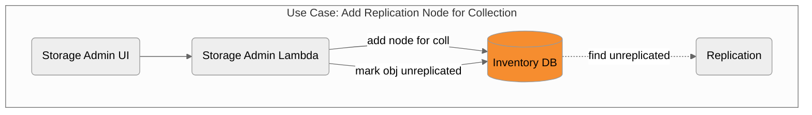
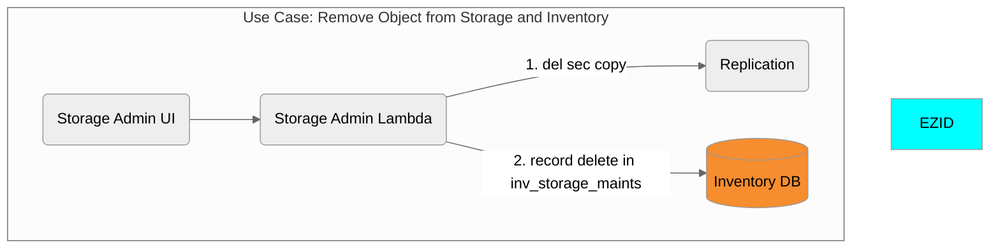
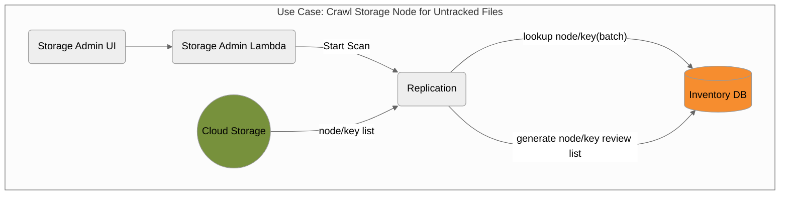
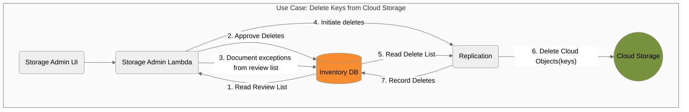
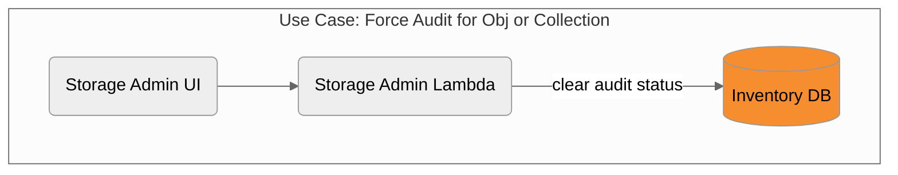

# Completed Storage Admin Features 

This page contains the source diagrams used in the creation of some of the features of Storage Admin functionality.

- [Storage Admin TODO Items](README.md)

### Add Storage Node

### Delete Secondary Copy of an Object

### Storage Scan

### Delete Keys

### Force Audit

