# To build from fragments

```
docker run --rm -v "$(pwd)/diagrams:/data" minlag/mermaid-cli mmdc -i overview.mmd -o overview.svg
docker run --rm -v "$(pwd)/diagrams:/data" minlag/mermaid-cli mmdc -i overview2.mmd -o overview2.svg
```

## Overview 1


## Overview 2

