# Merritt Diagrams Created with Mermaid
- [Merritt Flowchart and Sequence Chart Index](https://cdluc3.github.io/mrt-doc/diagrams/)
- [Mermaid Documentation](https://mermaid-js.github.io/mermaid/#/)

## To build diagram images from mermaid source (*.mmd)

The mermaid cli can be used to generate SVG for each mmd file.
```
docker run --rm -v "$(pwd)/diagrams:/data" minlag/mermaid-cli mmdc -w 1200 -i overview-core.mmd 
```

Run `diagrams/makeSvg.sh` to recreate the images that need to be regenerated.

## Style conventions

Colors
- Merritt Orange: use for databases
- Merritt Green: use for cloud storage
- Cyan: use for non-Merritt components
- Red border: highlight a component in focus for a diagram

Shapes
- `(round box)` - component
- `[(database)]` - databases
- ``((circle))`` - non database repository
- `[[border box]]` - browser pages and other readable objects
- `[box]` - AWS component
- `([extra rounded box])` - docker container
- other shapes - for emphasis

## Core Microservices
- [Graph Source](overview-core.mmd)

[](https://cdluc3.github.io/mrt-doc/diagrams/core_index)

## Dryad Microservices
- [Graph Source](overview-dryad.mmd)

[](https://cdluc3.github.io/mrt-doc/diagrams/dryad)

## Audit and Replic Microservices
- [Graph Source](overview-replic.mmd)

[](https://cdluc3.github.io/mrt-doc/diagrams/auditreplic)

## Scratch Pad
_Develop the diagrams in VSCode with a Mermaid extension. Move to a .mmd file for proper display on GitHub._

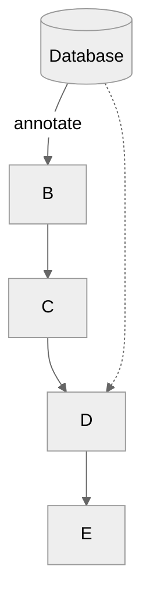

## Merritt UI
- [Graph Source](ui.mmd)

[](https://cdluc3.github.io/mrt-doc/diagrams/ui)

## Merritt Ingest
- [Graph Source](ingest.mmd)

[](https://cdluc3.github.io/mrt-doc/diagrams/ingest)

## Merritt Store (Ingest)
- [Graph Source](store-ing.mmd)

[](https://cdluc3.github.io/mrt-doc/diagrams/store-ing)

## Merritt Access (File Access)
- [Graph Source](store-fle.mmd)

[](https://cdluc3.github.io/mrt-doc/diagrams/store-file)

## Merritt Access (Object Access)
- [Graph Source](store-obj.mmd)

[](https://cdluc3.github.io/mrt-doc/diagrams/store-obj)

## Inventory
- [Graph Source](inventory.mmd)

[](https://cdluc3.github.io/mrt-doc/diagrams/inventory)


## Replic
- [Graph Source](replic.mmd)

[](https://cdluc3.github.io/mrt-doc/diagrams/replic)

## Audit
- [Graph Source](audit.mmd)

[](https://cdluc3.github.io/mrt-doc/diagrams/audit)

## OAI
- [Graph Source](oai.mmd)

[](https://cdluc3.github.io/mrt-doc/diagrams/oai)

## Sword
- [Graph Source](sword.mmd)

[](https://cdluc3.github.io/mrt-doc/diagrams/sword)

## Cloud Library
- [Graph Source](mrt-cloud.mmd)

[](https://cdluc3.github.io/mrt-doc/diagrams/mrt-cloud)

## LDAP
- [Graph Source](ldap.mmd)

[](https://cdluc3.github.io/mrt-doc/diagrams/ldap)

## Merritt Billing Update (Aggregation)
- [Graph Source](billing.mmd)

[](https://cdluc3.github.io/mrt-doc/diagrams/admin-billing)

## Merritt Admin Tool SPA
- [Graph Source](admin-spa.mmd)

[](https://cdluc3.github.io/mrt-doc/diagrams/admin-spa)

## Merritt Admin Tool Lambda
- [Graph Source](admin-lambda.mmd)

[](https://cdluc3.github.io/mrt-doc/diagrams/admin-lambda)

## Merritt Collection Admin Tool
- [Graph Source](colladmin.mmd)

[](https://cdluc3.github.io/mrt-doc/diagrams/colladmin)

## Admin Tool Sequence Diagram
- [Graph Source](admin-seq.mmd)

[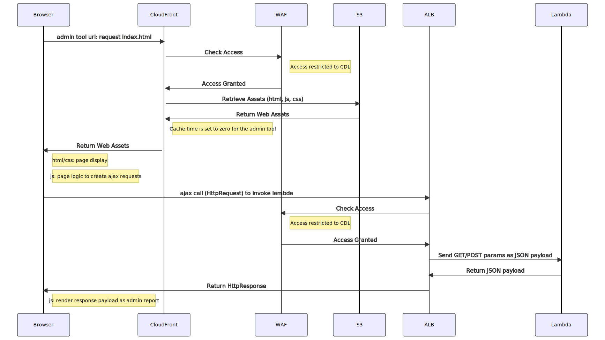](https://cdluc3.github.io/mrt-doc/diagrams/admin-seq)

## Admin Tool Sequence Diagram
- [Graph Source](colladmin-seq.mmd)

[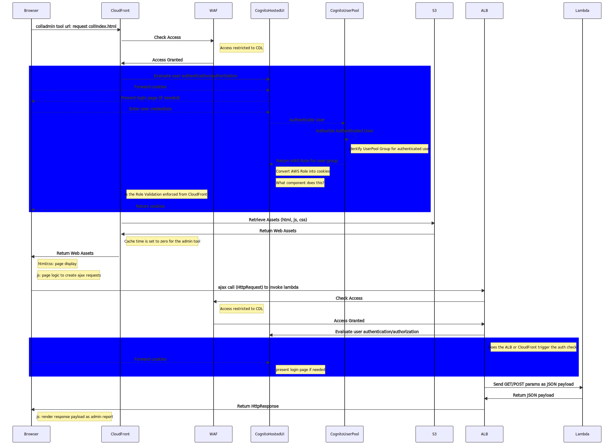](https://cdluc3.github.io/mrt-doc/diagrams/colladmin-seq)


## Storage Admin Tool: Add Replication Node for Collection
- [Graph Source](store-admin-add-node.mmd)

[](https://cdluc3.github.io/mrt-doc/diagrams/store-admin-add-node)

## Storage Admin Tool: Delete Replication Node for Collection
- [Graph Source](store-admin-del-node.mmd)

[](https://cdluc3.github.io/mrt-doc/diagrams/store-admin-del-node)

## Storage Admin Tool: Scan Storage Nodes for Untracked Keys
- [Graph Source](store-admin-scan-node.mmd)

[](https://cdluc3.github.io/mrt-doc/diagrams/store-admin-scan-node)

## Storage Admin Tool: Delete Keys from Cloud Storage
- [Graph Source](store-admin-del-node-keys.mmd)

[](https://cdluc3.github.io/mrt-doc/diagrams/store-admin-del-node-keys)

## Storage Admin Tool: Remove Object from Inventory, Generate Delete Lists for All Copies
- [Graph Source](store-admin-del-node-obj.mmd)

[](https://cdluc3.github.io/mrt-doc/diagrams/store-admin-del-node-obj)

## Storage Admin Tool: Force Audit for Collection/Object
- [Graph Source](store-admin-force-audit.mmd)

[](https://cdluc3.github.io/mrt-doc/diagrams/store-admin-force-audit)

## Storage Admin Tool: Change Primary Node
- [Graph Source](store-admin-change-primary-node.mmd)

[](https://cdluc3.github.io/mrt-doc/diagrams/store-admin-change-primary-node)

## Merritt Integration Tests
- [Graph Source](integ-tests.mmd)

[](https://cdluc3.github.io/mrt-doc/diagrams/integ-tests)

## Merritt Docker
- [Graph Source](docker.mmd)

[](https://cdluc3.github.io/mrt-doc/diagrams/docker)

## ETD Service (Diagram In Progress)
- [Graph Source](etd.mmd)

[](https://cdluc3.github.io/mrt-doc/diagrams/etd)
