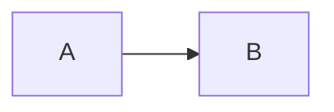

# To build from fragments

```
docker run --rm -v "$(pwd)/diagrams:/data" minlag/mermaid-cli mmdc -w 1200 -i overview-core.mmd 
docker run --rm -v "$(pwd)/diagrams:/data" minlag/mermaid-cli mmdc -w 1200 -i overview-dryad.mmd
docker run --rm -v "$(pwd)/diagrams:/data" minlag/mermaid-cli mmdc -w 1200 -i overview-replic.mmd

```

## Core Microservices
- [Graph Source](overview-core.mmd)


## Dryad Microservices
- [Graph Source](overview-dryad.mmd)


## Audit and Replic Microservices
- [Graph Source](overview-replic.mmd)


## Scratch Pad
_Develop the diagrams in VSCode and then move to a .mmd file_

