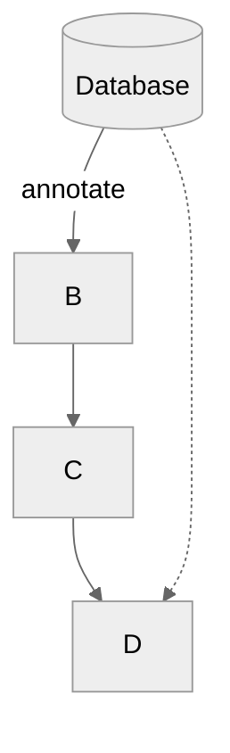

# Merritt Diagrams Created with Mermaid
[Mermaid Documentation](https://mermaid-js.github.io/mermaid/#/)
## To build diagram images from mermaid source (*.mmd)

The mermaid cli can be used to generate SVG for each mmd file.
```
docker run --rm -v "$(pwd)/diagrams:/data" minlag/mermaid-cli mmdc -w 1200 -i overview-core.mmd 
```

Run `diagrams/makeSvg.sh` to recreate the images that need to be regenerated.

## Style conventions

Colors
- Merritt Orange: use for databases
- Merritt Green: use for cloud storage
- Cyan: use for non-Merritt components
- Red border: highlight a component in focus for a diagram

Shapes
- `(round box)` - component
- `[(database)]` - databases
- ``((circle))`` - non database repository
- `[[border box]]` - browser pages and other readable objects
- `[box]` - AWS component
- `{{angle box}}` - docker container
- other shapes - for emphasis

## Core Microservices
- [Graph Source](overview-core.mmd)


## Dryad Microservices
- [Graph Source](overview-dryad.mmd)


## Audit and Replic Microservices
- [Graph Source](overview-replic.mmd)


## Scratch Pad
_Develop the diagrams in VSCode with a Mermaid extension. Move to a .mmd file for proper display on GitHub._



## Merritt UI


## Merritt Ingest


## Merritt Store (Ingest)


## Merritt Access (File Access)


## Merritt Access (Object Access)


## Inventory


## Replic


## Audit


## OAI


## Sword


## Merritt Billing Update (Aggregation)


## Merritt Admin Tool SPA


## Merritt Admin Tool Lambda


## Merritt Collection Admin Tool


## Merritt Integration Tests


## Merritt Docker


