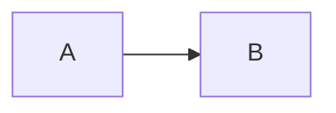

# To build from fragments

```
docker run --rm -v "$(pwd)/diagrams:/data" minlag/mermaid-cli mmdc -w 1200 -i overview-core.mmd 
docker run --rm -v "$(pwd)/diagrams:/data" minlag/mermaid-cli mmdc -w 1200 -i overview-dryad.mmd
docker run --rm -v "$(pwd)/diagrams:/data" minlag/mermaid-cli mmdc -w 1200 -i overview-replic.mmd

docker run --rm -v "$(pwd)/diagrams:/data" minlag/mermaid-cli mmdc -w 1200 -i ui.mmd
docker run --rm -v "$(pwd)/diagrams:/data" minlag/mermaid-cli mmdc -w 1200 -i ingest.mmd

docker run --rm -v "$(pwd)/diagrams:/data" minlag/mermaid-cli mmdc -w 1200 -i store-ing.mmd
docker run --rm -v "$(pwd)/diagrams:/data" minlag/mermaid-cli mmdc -w 1200 -i store-file.mmd
docker run --rm -v "$(pwd)/diagrams:/data" minlag/mermaid-cli mmdc -w 1200 -i store-obj.mmd

docker run --rm -v "$(pwd)/diagrams:/data" minlag/mermaid-cli mmdc -w 1200 -i inventory.mmd
docker run --rm -v "$(pwd)/diagrams:/data" minlag/mermaid-cli mmdc -w 1200 -i replic.mmd
docker run --rm -v "$(pwd)/diagrams:/data" minlag/mermaid-cli mmdc -w 1200 -i audit.mmd

```

## Core Microservices
- [Graph Source](overview-core.mmd)


## Dryad Microservices
- [Graph Source](overview-dryad.mmd)


## Audit and Replic Microservices
- [Graph Source](overview-replic.mmd)


## Scratch Pad
_Develop the diagrams in VSCode and then move to a .mmd file_



## Merritt UI


## Merritt Ingest


## Merritt Storage (Ingest)


## Merritt Storage (File Retrieval)


## Merritt Storage (Object Retrieval)


## Inventory


## Replic


## Audit


## OAI
TBD

## Sword
TBD

## Merritt Admin Tool
TBD

## Merritt Collection Admin Tool
TBD

## Merritt Integration Tests
TBD

## Merritt Docker
TBD

