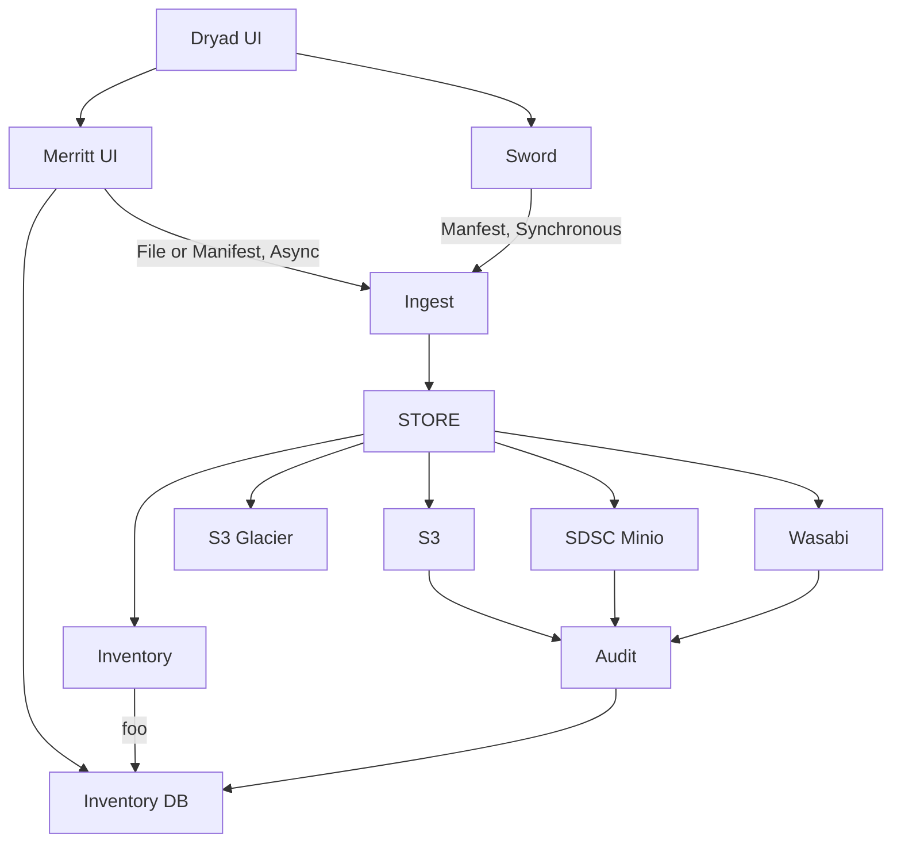
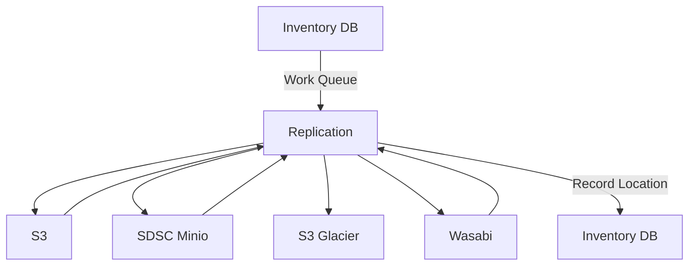

```mermaid
graph TD
    UI[Merritt UI] -->|File or Manifest, Async| ING(Go shopping)
    UI --> RDS
    ING[Ingest] --> STORE
    STORE --> S3[S3]
    STORE --> SDSC[SDSC Minio]
    STORE --> GLACIER[S3 Glacier]
    STORE --> WASABI[Wasabi]
    STORE --> INV[Inventory]
    INV -->|foo| RDS[Inventory DB]
    DRYAD[Dryad UI] --> UI
    DRYAD --> SWORD[Sword]
    SWORD --> |Manfest, Synchronous| ING
    S3 --> AUD[Audit]
    SDSC --> AUD
    WASABI --> AUD
    AUD --> RDS
```

## Replication

```mermaid
graph TD
    RDS1[Inventory DB] --> |Work Queue| REP
    REP[Replication] --> S3[S3]
    REP --> SDSC[SDSC Minio]
    REP --> GLACIER[S3 Glacier]
    REP --> WASABI[Wasabi]
    REP --> |Record Location| RDS2[Inventory DB]
    S3 --> REP
    SDSC --> REP
    WASABI --> REP
```