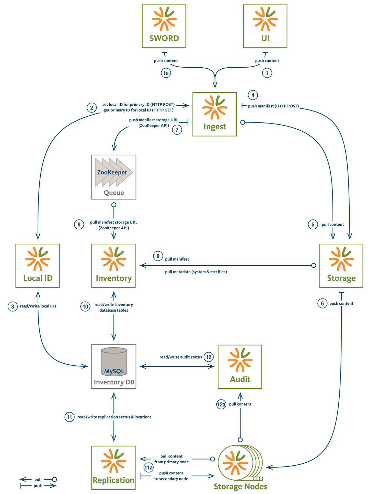
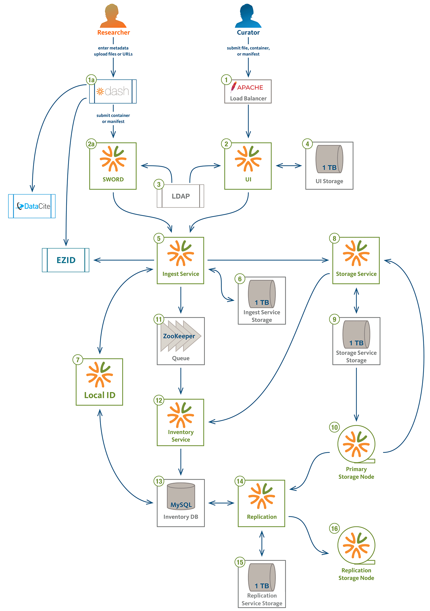
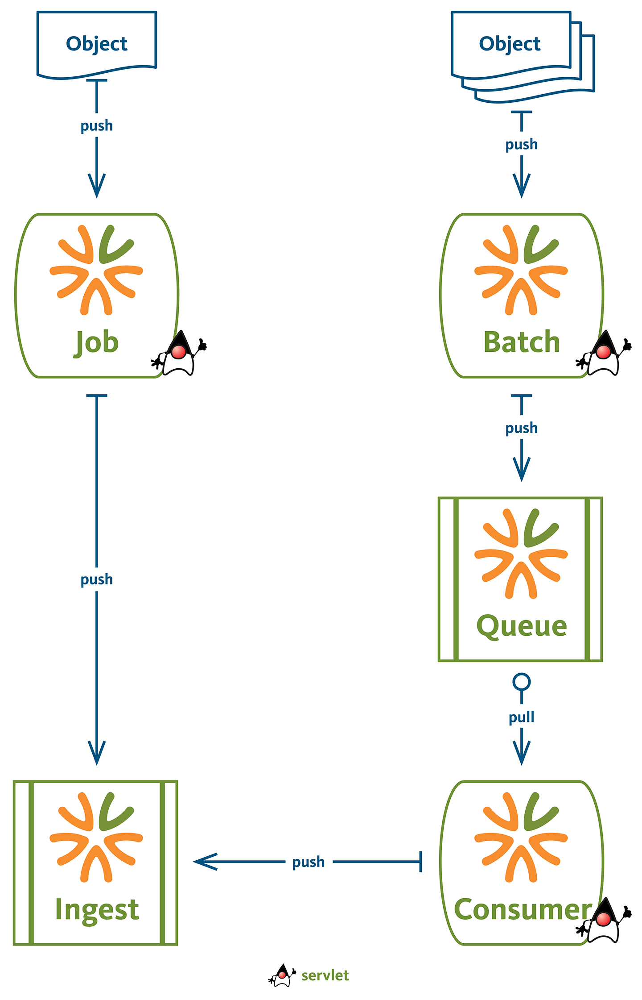
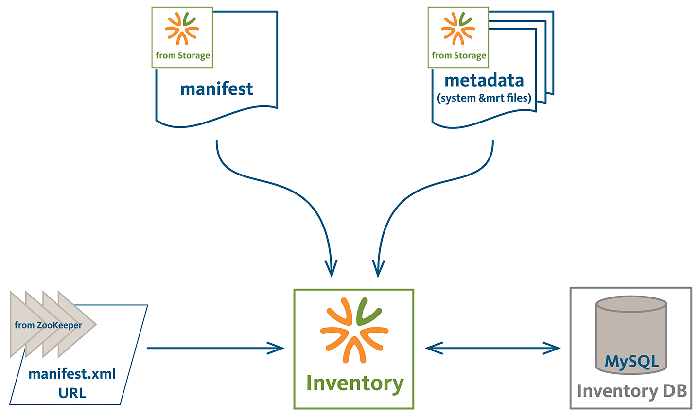
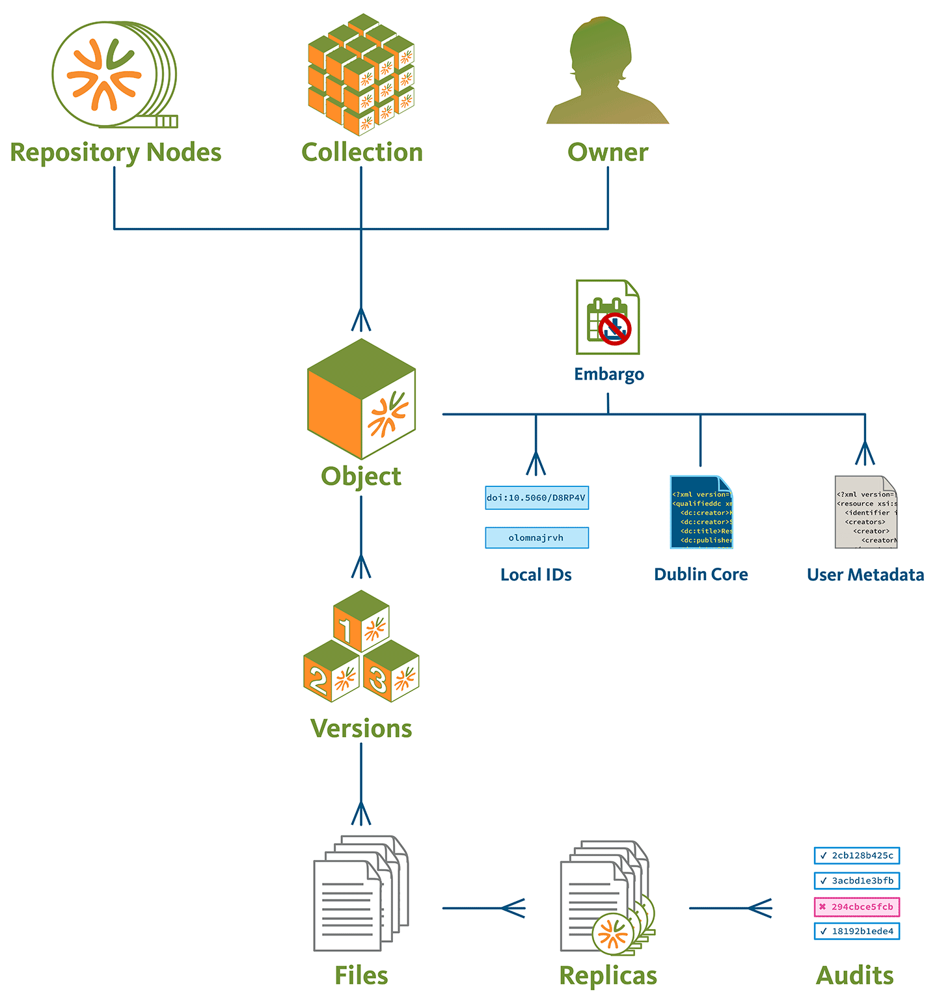
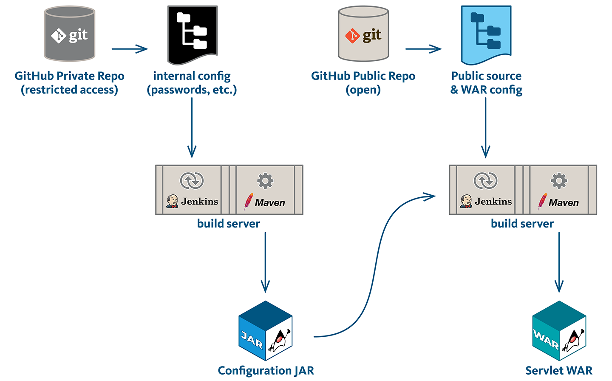
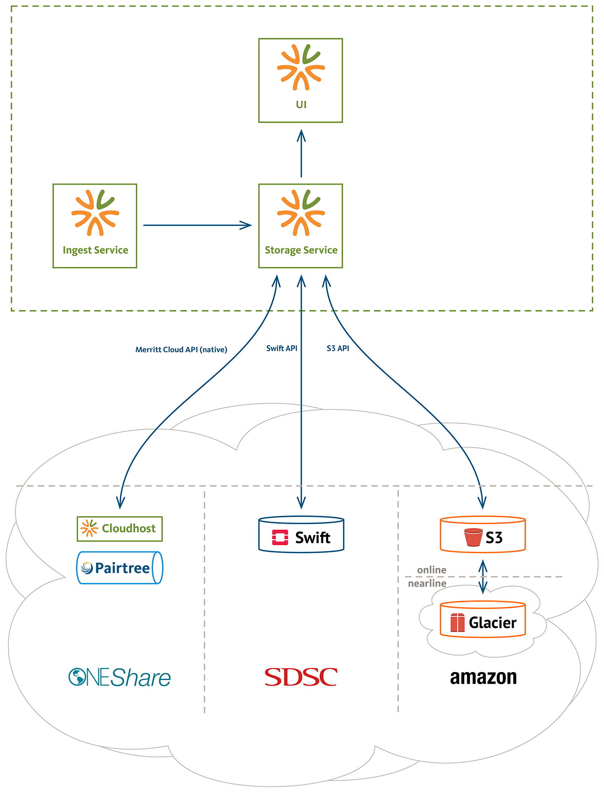

# Diagrams

- [Architecture](#architecture)
- [Audit](#audit)
- [Cloud Api](#cloud-api)
- [Dataflow](#dataflow)
- [Express](#express)
- [Ingest Process](#ingest-process)
- [Ingest Services](#ingest-services)
- [Inventory Build](#inventory-build)
- [Inventory Relationships](#inventory-relationships)
- [Maven / Jenkins](#maven--jenkins)
- [Storage](#storage)

## Architecture

## Audit

## Cloud Api

## Dataflow

## Express

## Ingest Process

## Ingest Services

## Inventory Build

## Inventory Relationships

## Maven / Jenkins

## Storage

